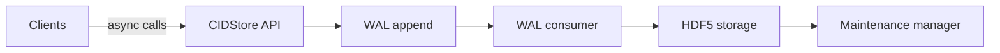
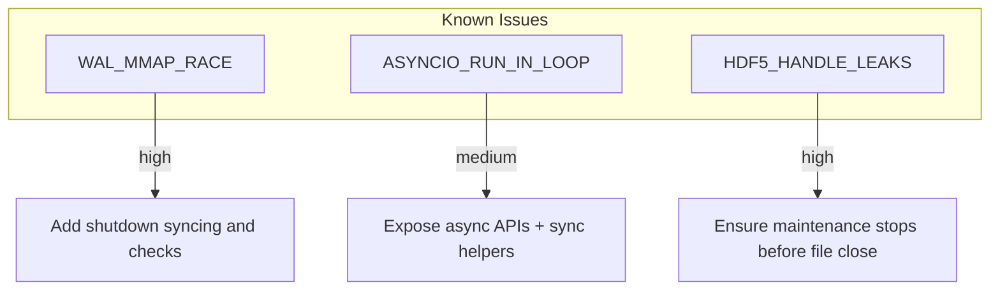

# Project summary for agents

This file is a concise machine-oriented summary of the `cidstore` project intended for other agents. It uses Markdown tables and Mermaid diagrams (not JSON) so agents that parse Markdown can extract structured data easily.

## Metadata

| key | value |
|---:|:---|
| name | cidstore |
| repo | amogorkon/cidtree |
| root | `E:/Dropbox/code/cidstore` |
| python_version | 3.13 |
| primary_contact | amogorkon |
| purpose | Content-addressed ID/key-value store with HDF5-backed buckets and an append-only WAL |

## High-level architecture

| component | description |
|---|---|
| storage | HDF5-backed storage for buckets, values, and directory metadata |
| wal | memory-mapped append-only write-ahead log |
| store | CIDStore API (insert/get/delete, directory management) |
| maintenance | background maintenance manager for GC/split/merge |
| async_zmq_server | optional network server using zmq for RPC |

## Key files and responsibilities

| path | responsibility |
|---|---|
| `src/cidstore/storage.py` | HDF5 dataset/group management; apply insert/delete; spill/promotion logic |
| `src/cidstore/wal.py` | WAL append/replay/truncate; mmap header management |
| `src/cidstore/store.py` | CIDStore class; replay orchestration; maintenance wiring |
| `src/cidstore/maintenance.py` | MaintenanceManager for deletion logs, GC, and bucket splitting/merging |
| `src/cidstore/async_zmq_server.py` | ZeroMQ async server exposing the store API |
| `conftest.py` | Pytest fixtures; testing mode toggles background services |
| `tests/` | Test suite covering storage, WAL, split/merge, concurrency, integration |

## Public APIs (conceptual)

| API | signature |
|---|---|
| CIDStore.__init__ | `CIDStore(hdf: Storage, wal: WAL, testing: bool=False)` |
| CIDStore.get | `async def get(key) -> list[Entry]` |
| CIDStore.insert | `async def insert(key, value)` |
| CIDStore.delete | `async def delete(key)` |
| CIDStore.lookup | `async def lookup(key) -> list[Entry]` |
| CIDStore.lookup_sync | `def lookup_sync(key) -> list[Entry]` |

## Runtime / dev commands

| task | command |
|---|---|
| run_tests | `py -m pytest -q` |
| run_single_test | `py -m pytest tests/test_wal.py::test_wal_file_recovery -q` |
| format | `mdformat . && ruff check . && mypy .` (optional) |
| start_server | `python -m src.cidstore.main` (or use `async_zmq_server`) |

## Known issues and test flakiness (agent actionable)

| id | summary | severity | action |
|---|---|---:|---|
| WAL_MMAP_RACE | Background WAL replay or consumer tasks sometimes access closed mmaps leading to `ValueError: mmap closed or invalid` | high | Ensure `WAL.close()` waits for background tasks to stop; add checks in replay loop |
| ASYNCIO_RUN_IN_LOOP | Code previously called `asyncio.run()` from inside an event loop causing `RuntimeError` | medium | Expose async APIs and provide sync helpers callable from non-running loops |
| HDF5_HANDLE_LEAKS | Background maintenance threads may access HDF5 after file close, causing invalid HDF5 identifier errors | high | Stop maintenance threads cleanly before closing HDF5 files; ensure `testing` disables background start |

## Agent guidelines and tasks

| task | desc | command | files |
|---|---|---|---|
| run_tests_and_report | Run test suite and produce machine-readable failure report | `py -m pytest -q --maxfail=1 --tb=long` | - |
| stabilize_wal_mmap | Instrument WAL for graceful shutdown and add test hooks | - | `src/cidstore/wal.py`, `src/cidstore/store.py` |
| scan_and_signature | Run ZVIC signature scan and report API changes | `py -m zvic scan . -o zvic-signatures.md` | - |
