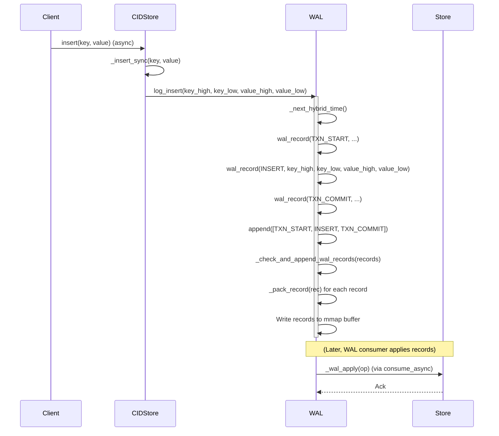

```mermaid
sequenceDiagram
    participant Client
    participant CIDStore
    participant WAL
    participant Store

    Client->>CIDStore: insert(key, value) (async)
    CIDStore->>CIDStore: _insert_sync(key, value)
    CIDStore->>WAL: log_insert(key_high, key_low, value_high, value_low)
    activate WAL
    WAL->>WAL: _next_hybrid_time()
    WAL->>WAL: wal_record(TXN_START, ...)
    WAL->>WAL: wal_record(INSERT, key_high, key_low, value_high, value_low)
    WAL->>WAL: wal_record(TXN_COMMIT, ...)
    WAL->>WAL: append([TXN_START, INSERT, TXN_COMMIT])
    WAL->>WAL: _check_and_append_wal_records(records)
    WAL->>WAL: _pack_record(rec) for each record
    WAL->>WAL: Write records to mmap buffer
    deactivate WAL
    Note over WAL,Store: (Later, WAL consumer applies records)
    WAL->>Store: _wal_apply(op) (via consume_async)
    Store-->>WAL: Ack

```