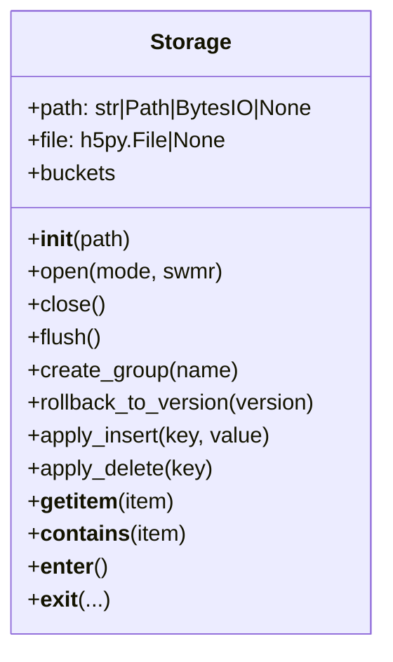
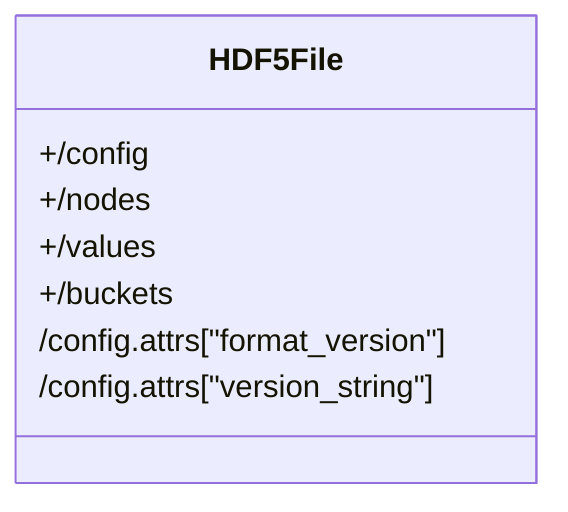

# Storage: HDF5 File Manager and WAL Hooks

## Overview

The `Storage` class in `storage.py` manages HDF5 file operations for CIDTree, supporting both file-based and in-memory storage. It provides context management, group creation, and hooks for write-ahead logging (WAL) compatibility.

---

## UML Class Diagram



---

## Key Data Structures

| Component | Fields / Attributes                              | Description                                               |
|-----------|--------------------------------------------------|-----------------------------------------------------------|
| Storage   | `path`, `file`                                   | Manages HDF5 file handle and path/buffer                  |
|           |                                                  |                                                           |
|           | `CONFIG_GROUP`, `NODES_GROUP`, `VALUES_GROUP`    | Constants for core HDF5 groups                            |
|           |                                                  |                                                           |
|           | `buckets` property                               | Returns `/buckets` group as dict-like object              |

---

## Core Methods

| Method                | Description                                                                 |
|-----------------------|-----------------------------------------------------------------------------|
| `__init__(path)`      | Initialize with file path or in-memory buffer                               |
| `open(mode, swmr)`    | Open HDF5 file, create core groups if needed                                |
| `close()`             | Flush and close the HDF5 file                                               |
| `flush()`             | Flush in-memory buffers to disk                                             |
| `create_group(name)`  | Create a group in the HDF5 file                                             |
| `rollback_to_version(version)` | Stub for WAL compatibility                                         |
| `apply_insert(key, value)` | Stub for WAL replay; bind to tree insert                               |
| `apply_delete(key)`   | Stub for WAL replay; bind to tree delete                                    |
| `buckets`             | Property: returns `/buckets` group                                          |
| `__getitem__(item)`   | Subscript access to HDF5 file                                               |
| `__contains__(item)`  | Membership test for HDF5 file                                               |
| `__enter__()`         | Context manager enter (opens file)                                          |
| `__exit__()`          | Context manager exit (closes file)                                          |

---

## Group and Attribute Layout



- `/config`, `/nodes`, `/values`, `/buckets` are always present.
- `/config` contains attributes: `format_version`, `version_string`.

---

## WAL Integration

- `apply_insert` and `apply_delete` are stub hooks for WAL replay.
- These should be bound to the actual tree's insert/delete methods for WAL compatibility.

---

## Example Usage

```python
from cidstore.storage import Storage

storage = Storage("mydata.h5")
with storage as h5f:
    group = storage.create_group("mygroup")
    # ... work with HDF5 groups/datasets ...
storage.close()
```

---

## Notes

- Supports both file-based and in-memory (BytesIO) HDF5 storage.
- Ensures core groups exist on open.
- Context manager support for safe open/close.
- Designed for integration with WAL and higher-level tree logic.

---