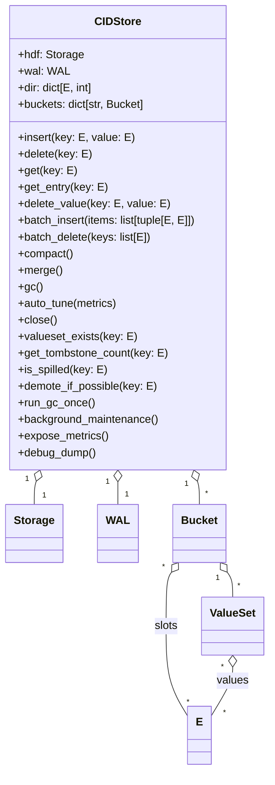
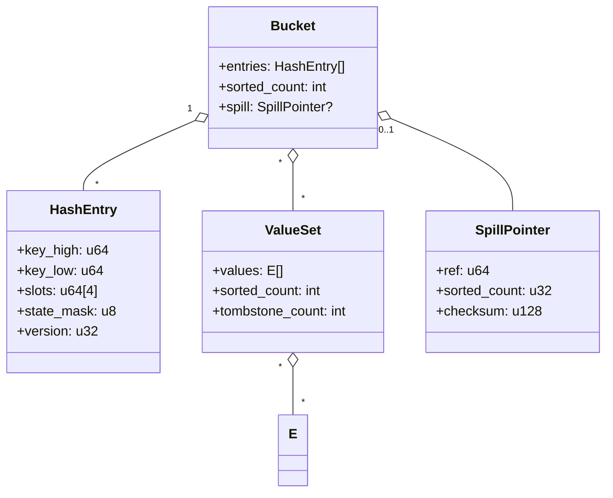

# CIDStore: Main Hash Directory, Bucket, and ValueSet Logic

## Overview

The `CIDStore` class is the main entry point for the CIDStore hash directory.
It provides a fully async interface for all public methods, with synchronous logic under the hood.
The store manages a directory of buckets, each containing hash entries and value sets, and supports WAL-based durability.

---

## UML Class Diagram



---

## Key Data Structures

| Component   | Fields / Attributes                                                                 | Description                                                                 |
|-------------|-------------------------------------------------------------------------------------|-----------------------------------------------------------------------------|
| CIDStore    | `hdf: Storage`, `wal: WAL`, `dir: dict[E, int]`, `buckets: dict[str, Bucket]`       | Main store object, manages directory and buckets                            |
| Bucket      | `entries: HashEntry[]`, `sorted_count: int`, `spill: SpillPointer?`                 | Holds hash entries, sorted/unsorted regions, and optional spill pointer     |
| HashEntry   | `key_high: u64`, `key_low: u64`, `slots: u64[4]`, `state_mask: u8`, `version: u32`  | Maps a key to up to 4 values (inline), state mask encodes slot usage/ECC    |
| ValueSet    | `values: E[]`, `sorted_count: int`, `tombstone_count: int`                          | External dataset for high-cardinality keys                                  |
| SpillPointer| `ref: u64`, `sorted_count: u32`, `checksum: u128`                                   | Points to external value-list location                                      |
| Directory   | `buckets: Bucket[]`, `num_buckets: int`                                             | Array of buckets, stored as HDF5 datasets                                   |
| E           | `high: u64`, `low: u64`                                                            | 128-bit entity key                                                          |

---

## Core Methods

| Method                | Description                                                                                   |
|-----------------------|-----------------------------------------------------------------------------------------------|
| `insert(key, value)`  | Insert a key-value pair, handling inline/spill logic and WAL logging                          |
| `delete(key)`         | Delete a key and all its values                                                               |
| `get(key)`            | Get all values for a key (inline or spilled)                                                  |
| `get_entry(key)`      | Retrieve the canonical entry dict for a key                                                   |
| `delete_value(key, value)` | Delete a specific value from a key                                                        |
| `batch_insert(items)` | Batch insert multiple key-value pairs                                                         |
| `batch_delete(keys)`  | Batch delete multiple keys                                                                    |
| `compact()`           | Compact all buckets                                                                           |
| `merge()`             | Merge/maintenance operation                                                                   |
| `gc()`                | Run garbage collection                                                                        |
| `auto_tune(metrics)`  | Auto-tune batch size and flush interval based on metrics                                      |
| `close()`             | Close the store and flush all data                                                            |
| `valueset_exists(key)`| Check if a value set exists for a key                                                         |
| `get_tombstone_count(key)` | Count tombstones (zeros) in the spill dataset for a key                                   |
| `is_spilled(key)`     | Check if a key has spilled values (external dataset)                                          |
| `demote_if_possible(key)` | Move spilled values back to inline slots if possible                                       |
| `run_gc_once()`       | Run background GC and remove empty spill datasets                                             |
| `background_maintenance()` | Run background merge/sort/compaction for all buckets                                      |
| `expose_metrics()`    | Expose Prometheus metrics (if available)                                                      |
| `debug_dump()`        | Dump the entire tree structure for debugging                                                  |

---

## Bucket and ValueSet Layout



---

## Directory Storage

- The directory is stored either as an HDF5 attribute (`/config:dir`) or as a canonical dataset (`/dir` or sharded `/dir/shard_xxxx`).
- The directory maps each key to a bucket ID.
- Migration from attribute to dataset occurs automatically when the directory exceeds a threshold.

---

## WAL Integration

- All mutating operations are logged to the Write-Ahead Log (WAL) for durability and crash recovery.
- WAL replay is supported for recovery after a crash.

---

## Async API

- All public methods are async and use `asyncio.to_thread` to run sync logic in a thread pool.
- WAL consumer runs as an async background task.

---

## Example Usage

```python
from cidstore.keys import E
from cidstore.storage import Storage
from cidstore.store import CIDStore
from cidstore.wal import WAL

storage = Storage("mydata.h5")
wal = WAL("mywal.log")
store = CIDStore(storage, wal)

await store.insert(E.from_str("foo"), E(123))
values = await store.get(E.from_str("foo"))
await store.delete(E.from_str("foo"))
await store.close()
```

---

## Notes

- The implementation is designed for O(1) access and high concurrency.
- All data structures are fixed-width and HDF5-backed.
- Inline slots are used for up to 4 values per key; spill to external ValueSet for more.
- ECC-protected state masks ensure resilience to bit-flips.

---
