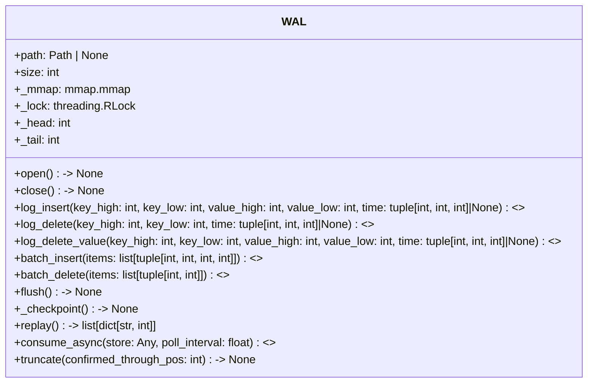

# WAL: Write-Ahead Log Logic

## Overview

The `WAL` class provides durability and crash recovery for the CIDStore by logging all mutating operations.
It supports async and sync interfaces, batch operations, checkpointing, and replay for recovery.

---

## UML Class Diagram



---

## Key Data Structures

| Component | Fields / Attributes | Description |
|-----------|--------------------|-------------|
| WAL       | `path: Path | None`, `size: int`, `_mmap: mmap.mmap`, `_lock: threading.RLock`, `_head: int`, `_tail: int` | Write-ahead log object, manages log file and concurrency |
| Log Entry | `op_type: int`, `version: int`, `key_high: int`, `key_low: int`, `value_high: int`, `value_low: int`, ... | Encodes an operation (insert, delete, etc.) and its arguments |

---

## Core Methods

| Method                              | Description                                                      |
|--------------------------------------|------------------------------------------------------------------|
| `open() -> None`                    | Open the WAL file for appending                                  |
| `close() -> None`                   | Close the WAL file                                               |
| `log_insert(key_high: int, key_low: int, value_high: int, value_low: int, time: tuple[int, int, int] | None = None) -> Awaitable[None]` | Log an insert operation (async) |
| `log_delete(key_high: int, key_low: int, time: tuple[int, int, int] | None = None) -> Awaitable[None]` | Log a delete operation (async) |
| `log_delete_value(key_high: int, key_low: int, value_high: int, value_low: int, time: tuple[int, int, int] | None = None) -> Awaitable[None]` | Log a delete-value operation (async) |
| `batch_insert(items: list[tuple[int, int, int, int]]) -> Awaitable[None]` | Batch log multiple insert operations (async) |
| `batch_delete(items: list[tuple[int, int]]) -> Awaitable[None]` | Batch log multiple delete operations (async) |
| `flush() -> None`                   | Flush the WAL file to disk                                       |
| `_checkpoint() -> None`              | Create a checkpoint in the WAL                                   |
| `replay() -> list[dict[str, int]]`   | Replay the WAL for recovery                                      |
| `consume_async(store: Any, poll_interval: float = 0.1) -> Awaitable[None]` | Async consumer for applying WAL operations to the store          |
| `truncate(confirmed_through_pos: int) -> None` | Truncate the WAL up to a given position                          |

---

## WAL Format

- Each log entry is a fixed-width binary record describing the operation and its arguments.
- Supported operations: `insert`, `delete`, `delete_value`, `checkpoint`.
- Checkpoints mark safe points for truncation or compaction.

---

## Async API

- Async methods are marked with `<<async>>` in the UML and tables.
- The WAL consumer can run as an async background task, applying log entries to the store.

---

## Example Usage

```python
from cidstore.wal import WAL

wal = WAL("mywal.log")
wal.open()
await wal.log_insert(0x123, 0x456, 0x789, 0xabc)
await wal.log_delete(0x123, 0x456)
wal.flush()
wal.close()
```

---

## Notes

- The WAL ensures durability for all mutating operations in CIDStore.
- WAL replay is required after a crash to restore the store to a consistent state.
- Batch operations improve throughput and reduce disk I/O.
- Checkpoints allow for log truncation and compaction.

---
