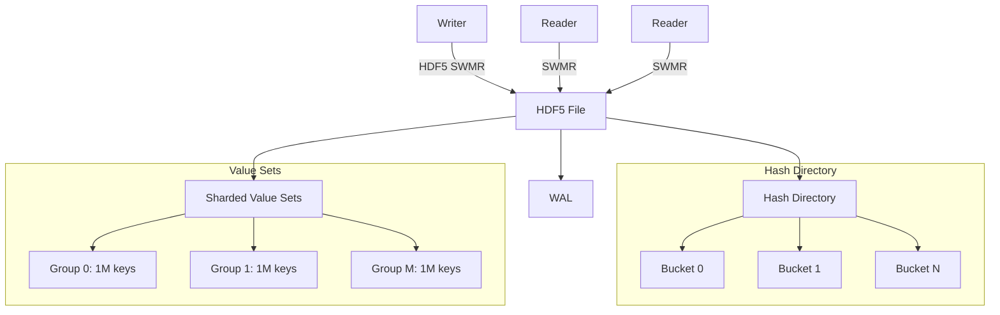

# 1. Introduction

## 1.1 Core Purpose
**Objective:** Provide a disk-backed, concurrent hash directory for mapping 128-bit keys (split into two 64-bit integers) to variable-sized sets of 128-bit values, optimized for:

- Massive-scale many-to-many relationships (e.g., key → {value₁, value₂, ...}).
- High insert throughput (>1M ops/sec sustained).
- Low-latency exact key lookups (P99 < 100µs).
- Crash consistency with minimal recovery time.

**Optimization:**

- **HDF5 SWMR mode:** Enables concurrent reads during writes.
- **Extensible hashing:** Dynamically resizes buckets to maintain performance.
- **Sharded value sets:** Groups values into chunked datasets to limit metadata overhead.

## 1.2 Use Case
Designed for triplestore backends requiring semantically stable key-value mappings where:

- **Keys** are immutable, SHA3-derived identifiers (e.g., truncated CIDs or composite SPO hashes).
- **Values** represent relationships (e.g., all objects O for a subject-predicate pair (S, P)).
- **Operations** are read-heavy, with bursty bulk inserts and rare deletions.

## 1.3 Key Characteristics
### Key Semantics:

- SHA3-derived keys are uniformly distributed, optimizing hash-table performance.
- Composite keys (e.g., (S, P) → O) are precomputed externally; the hash directory treats them as opaque 128-bit values.

### Value Storage:

- Values are stored in contiguous, compressed HDF5 datasets grouped by key shards.
- No in-band metadata (e.g., counts)—value sets are append-only for simplicity.

### Concurrency:

- Single writer with global lock for bucket resizing/value appends.
- Unlimited readers via HDF5’s SWMR mode.

## 1.4 Performance Targets
| Metric            | Target                  | Rationale                          |
|-------------------|-------------------------|------------------------------------|
| Insert Throughput | >1M ops/sec (batched)   | Bulk ingestion of AI training data |
| Lookup Latency    | <50µs (avg), <100µs (P99)| Real-time query responsiveness     |
| Recovery Time     | <30s after crash        | SWMR + WAL checkpointing           |
| Scalability       | 1B keys, 100B values    | Chunked/sharded storage            |

## 1.5 Non-Goals

- **Range Queries:** Keys are unordered; use external indexing for [key₁, key₂] scans.
- **In-Place Updates:** Keys/values are immutable once written.
- **Transaction Isolation:** Readers see eventually consistent states after writes.

## 1.6 Architecture Overview

## 1.7 Design Invariants

- **Key Immutability:** Once written, a key’s value set cannot be modified (only appended to).
- **Bucket Load Factor:** Hash buckets resize when >75% full to maintain O(1) lookups.
- **Value Set Sharding:** No group exceeds 1M keys to limit metadata overhead.