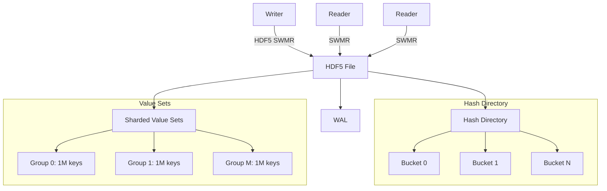

# 1. Introduction

| Feature                | Target/Description                       |
|------------------------|------------------------------------------|
| Scale                  | 1B keys, 100B values                     |
| Insert Throughput      | >1M ops/sec (batched)                    |
| Lookup Latency         | <50μs (avg), <100μs (P99)                |
| Recovery Time          | <30s after crash                         |
| Concurrency            | SWMR: 1 writer, many readers             |
| Range Queries          | Not supported                            |
| Transaction Isolation  | Eventual consistency for readers         |

**Key Points:**
- Disk-backed, concurrent hash directory for 128-bit keys/values
- Optimized for scale, throughput, and crash consistency
- HDF5 SWMR mode for concurrency; extensible hashing for scalability

**Non-Goals:**
- No range queries (unordered keys)
- No in-place updates (append-only)
- Readers see eventual consistency
- No built-in access control, authentication, or encryption (must be external)

### Architecture Overview

## 1.8 Dependencies

| Dependency       | Version   | Description                                  |
|------------------|-----------|----------------------------------------------|
| Python           | 3.12      | Minimum required version                     |
| HDF5             | 1.14.6    | Scalable, chunked, compressed storage        |
| h5py             | 3.13      | Python interface to HDF5                     |
| NumPy            | 2.2.5     | Efficient data manipulation, dtypes          |
| CRC32C           | 2.7.1     | Checksum validation for data integrity       |

---

## 1.9 Testing & Validation

- System-level tests cover all workflows (insert, lookup, delete, split/merge, promotion/demotion)
- Crash recovery tests simulate failures at all WAL/CoW/metadata stages
- Fuzzing/randomized ops to uncover edge cases and concurrency bugs
- GC/orphan detection tests ensure correct reclamation and reconciliation
- All recovery/GC ops must be idempotent and leave the system consistent

> **Note:** These strategies are mandatory for production and must be in CI. Manual and automated validation of recovery paths is essential for long-term data safety.