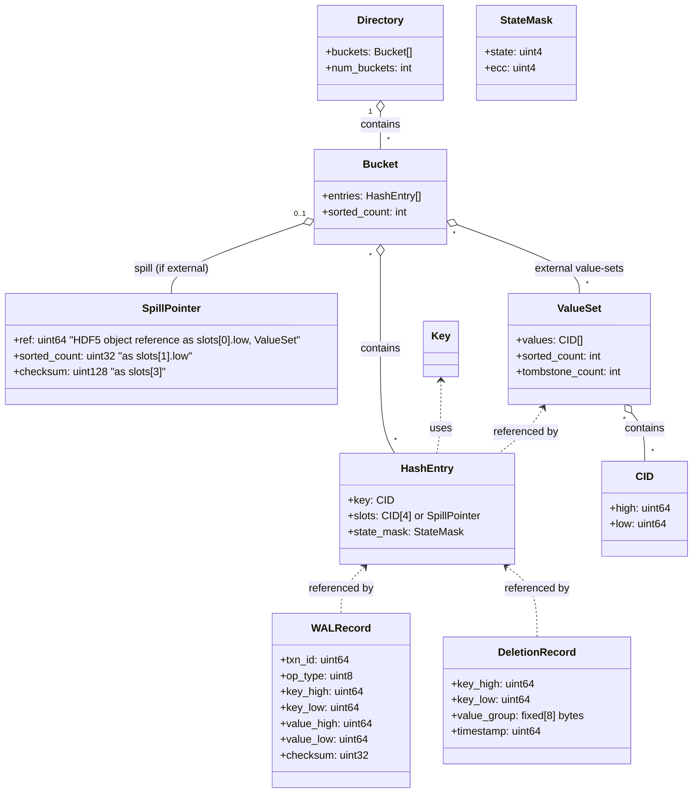

# 2. Data Types and Structure

## 2.1 Data Structure

The following diagram integrates all core data structures, including bucket structure, directory management, and multi-value key/value-list handling:

---

## 2.2 Data Type Definitions

All types are fixed-width for O(1) access. See UML above for explicit field names and dtypes.

| Component         | Structure / dtype fields                                      | Size   | Description                                                      |
|-------------------|--------------------------------------------------------------|--------|------------------------------------------------------------------|
| Key               | `[high: u64, low: u64]`                                      | 16B    | 128-bit immutable identifier (SHA3 or composite hash)            |
| Hash Entry        | `[key_high: u64, key_low: u64, value_group: S8, value_start: u32, value_count: u32]` | 32B    | Maps key to value set in bucket; value_group is 8-byte ID        |
| Value Set        | `[CID[] values, tombstone_count: u32]`                       | Var    | External dataset for high-cardinality keys; tombstone for GC     |
| Spill Pointer     | `[shard_id: u16, bucket_local: u32, segment_id: u16]`        | 8B     | Points to external value-list location (spill mode)              |
| State Mask        | `u8` (ECC-encoded 4-bit mask; 4 bits used, 4 ECC)            | 1B     | Encodes entry state (inline/spill/tombstone); ECC-protected, SIMD-friendly |
| WAL Record        | `[txn_id: u64, op_type: u8, key_high: u64, key_low: u64, value_high: u64, value_low: u64, checksum: u32]` | 45B    | Logs inserts/deletes for recovery; CRC32 checksum                |
| Deletion Record   | `[key_high: u64, key_low: u64, value_group: S8, timestamp: u64]` | 32B    | Tracks obsolete keys for GC; timestamp is Unix ns                |
| Directory         | `[Bucket[] buckets, num_buckets: u32]`                        | Var    | Array of buckets, stored as HDF5 datasets                        |
| Bucket            | `[HashEntry[] entries, sorted_count: u32, SpillPointer? spill]`| Var    | Bucket with sorted and unsorted regions; `sorted_count` tracks the number of entries in the sorted region (enabling fast binary search), while new inserts are appended to the unsorted region. Optional spill pointer for external value-lists. |

## sorted_count Purpose
- The `sorted_count` field in the either Bucket and ValueSet structure is used to track the number of entries in the sorted region. This allows for efficient binary search operations on the sorted entries, while new inserts are appended to the unsorted region.

|Layer|	Purpose
|---|---|
|Bucket|	Optimizes key lookup in hash entrys
|ValueSet|	Optimizes containment checks for a single value within the set of values & deduplication

## 2.3 Metadata & Constraints

- All fields are fixed-width for O(1) access
- No variable-length fields; value_group is 8 bytes
- Keys and value pointers are immutable after insertion
- SWMR metadata stored as HDF5 attributes under `/config`

### State Mask (ECC-encoded)
- The `State Mask` is a compact, ECC-protected 4-bit field (stored as a single byte) used to encode the state of each hash entry (e.g., inline/spill mode, tombstone, etc.).
- Error-correcting code (ECC) ensures resilience to bit-flips and supports SIMD-friendly operations.
- For detailed encoding and usage, see [Spec 5: Multi-Value Keys](spec%205%20-%20Multi-Value%20Keys.md#state-mask-ecc).
