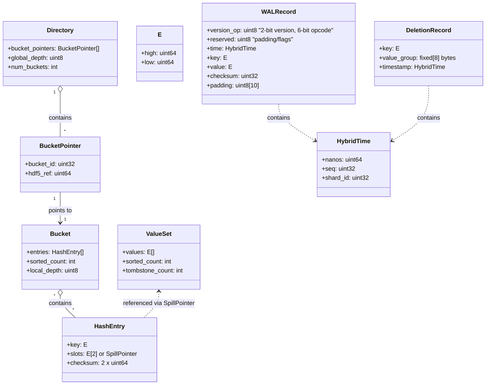
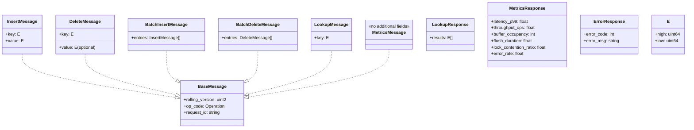

# 2. Data Types and Structure

## 2.1 Data Structure

**Note:** The UML diagram below is the authoritative source for all structure layouts.



---

## 2.2 Data Type Definitions

All types are fixed-width for O(1) access. See UML above for explicit field names and dtypes.

| Component         | Structure / dtype fields                                      | Size   | Description                                                      |
|-------------------|--------------------------------------------------------------|--------|------------------------------------------------------------------|
| Key               | `[high: u64, low: u64]`                                      | 16B    | 128-bit immutable identifier (SHA3 or composite hash)            |
| Hash Entry        | `[key_high: u64, key_low: u64, slots: [E, E] or SpillPointer, checksum: u128]` | 64B    | Maps key to up to two values inline, or to an external ValueSet via SpillPointer. No state mask. |
| Value Set         | `[E[] values, sorted_count: u32, tombstone_count: u32]`    | Var    | External dataset for high-cardinality keys; tombstone for GC     |
| Spill Pointer     | `[ref: u64]`                                                 | 8B     | HDF5 object reference to external ValueSet (spill mode)          |
| Deletion Record   | `[key_high: u64, key_low: u64, value_group: S8, timestamp: u64]` | 32B    | Tracks obsolete keys for GC; timestamp is Unix ns                |
| Directory         | `[BucketPointer[] bucket_pointers, global_depth: u8, num_buckets: u32]` | Var    | Array of bucket pointers indexed by top `global_depth` bits of key |
| Bucket            | `[HashEntry[] entries, sorted_count: u32, local_depth: u8]` | Var    | Bucket with sorted and unsorted regions; `local_depth` determines key bits that belong to this bucket |
| Bucket Pointer    | `[bucket_id: u32, hdf5_ref: u64]`                           | 12B    | Points to bucket dataset in HDF5, indexed by key prefix          |

## 2.3 Extendible Hashing Scheme

### Bucket Lookup Algorithm

```python
def find_bucket(key: E, global_depth: int) -> bucket_id:
    # Extract top global_depth bits from key.high
    directory_index = key.high >> (64 - global_depth)
    return directory.bucket_pointers[directory_index].bucket_id
```

### Directory Size

- Directory size is always `2^global_depth` entries
- Each entry is a `BucketPointer` that maps to the actual bucket
- Multiple directory entries may point to the same bucket (when `local_depth < global_depth`)

## sorted_count Purpose
- The `sorted_count` field in the either Bucket and ValueSet structure is used to track the number of entries in the sorted region. This allows for efficient binary search operations on the sorted entries, while new inserts are appended to the unsorted region.

|Layer|	Purpose
|---|---|
|Bucket|	Optimizes key lookup in hash entrys
|ValueSet|	Optimizes containment checks for a single value within the set of values & deduplication

## 2.4 Metadata & Constraints

- All fields are fixed-width for O(1) access (except ValueSet.values, which is a fixed-type array)
- No variable-length fields; all pointers are explicit (BucketPointer contains HDF5 object reference)
- Keys and value pointers are immutable after insertion
- SWMR metadata stored as HDF5 attributes under `/config`
- `global_depth` stored as HDF5 attribute under `/config/global_depth`
- Each bucket's `local_depth` stored as HDF5 attribute on the bucket dataset

### SpillPointer and Promotion
- The presence of a SpillPointer in a HashEntry indicates that the values for the key are stored externally in a ValueSet dataset.
- When a key has more than two values, the entry is promoted to spill mode and a SpillPointer is used.
- Demotion is possible if the value count drops to two or fewer.

## 2.5 Network Message Schema (msgpack via zmq)

**Note:** The UML diagram below is the authoritative source for all network message layouts.



---

### Network Message Type Definitions

| Message Type         | Fields / dtype fields                                                                 | Description                                                                 |
|----------------------|--------------------------------------------------------------------------------------|-----------------------------------------------------------------------------|
| BaseMessage          | `[rolling_version: uint2, op_code: Operation, request_id: string]`                   | All messages include a 2-bit rolling version, operation code, and request id|
| InsertMessage        | `[key: E, value: E]`                                                             | Insert a single value for a key                                              |
| DeleteMessage        | `[key: E, value: E (optional)]`                                                  | Delete a value for a key (or all values if value omitted)                    |
| BatchInsertMessage   | `[entries: InsertMessage[]]`                                                         | Batch insert of multiple key-value pairs                                     |
| BatchDeleteMessage   | `[entries: DeleteMessage[]]`                                                         | Batch delete of multiple key-value pairs                                     |
| LookupMessage        | `[key: E]`                                                                         | Lookup all values for a key                                                  |
| MetricsMessage       | `[]`                                                                                 | Request server metrics                                                       |
| LookupResponse       | `[results: E[]]`                                                                   | Response to a lookup, contains all values                                    |
| MetricsResponse      | `[latency_p99: float, throughput_ops: float, buffer_occupancy: int, flush_duration: float, lock_contention_ratio: float, error_rate: float]` | Server metrics response                                                      |
| ErrorResponse        | `[error_code: int, error_msg: string]`                                               | Standardized error response                                                  |

**Operation Enum Values:**

| Value                | Description                                      |
|----------------------|--------------------------------------------------|
| INSERT               | Insert a single value for a key                  |
| DELETE_KEY           | Delete all values for a key                      |
| DELETE_VALUE_FROM_KEY| Delete a specific value from a key               |
| BATCH_INSERT         | Insert multiple key-value pairs in a batch       |
| BATCH_DELETE         | Delete multiple key-value pairs in a batch       |
| GET                  | Get all values for a given key                   |
| METRICS              | Request server metrics                           |

**E Structure:**

| Field | Type    | Description         |
|-------|---------|---------------------|
| high  | uint64  | High 64 bits of E |
| low   | uint64  | Low 64 bits of E  |

---