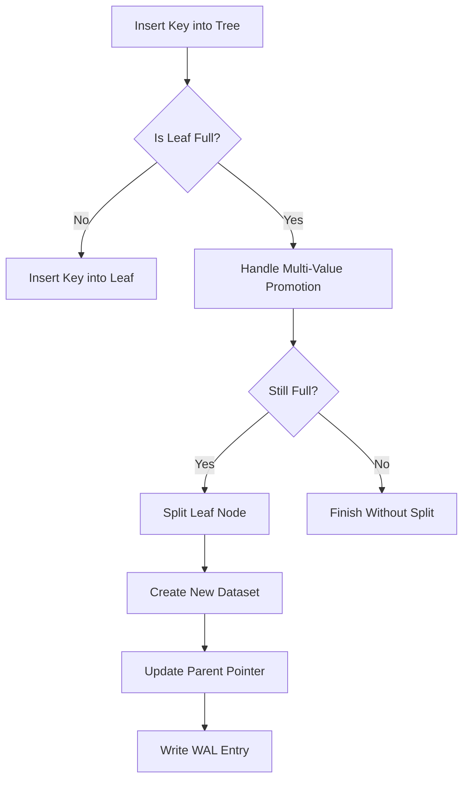
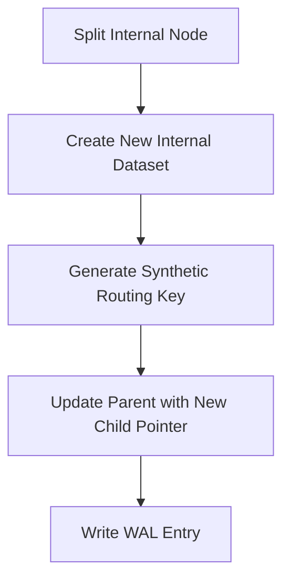
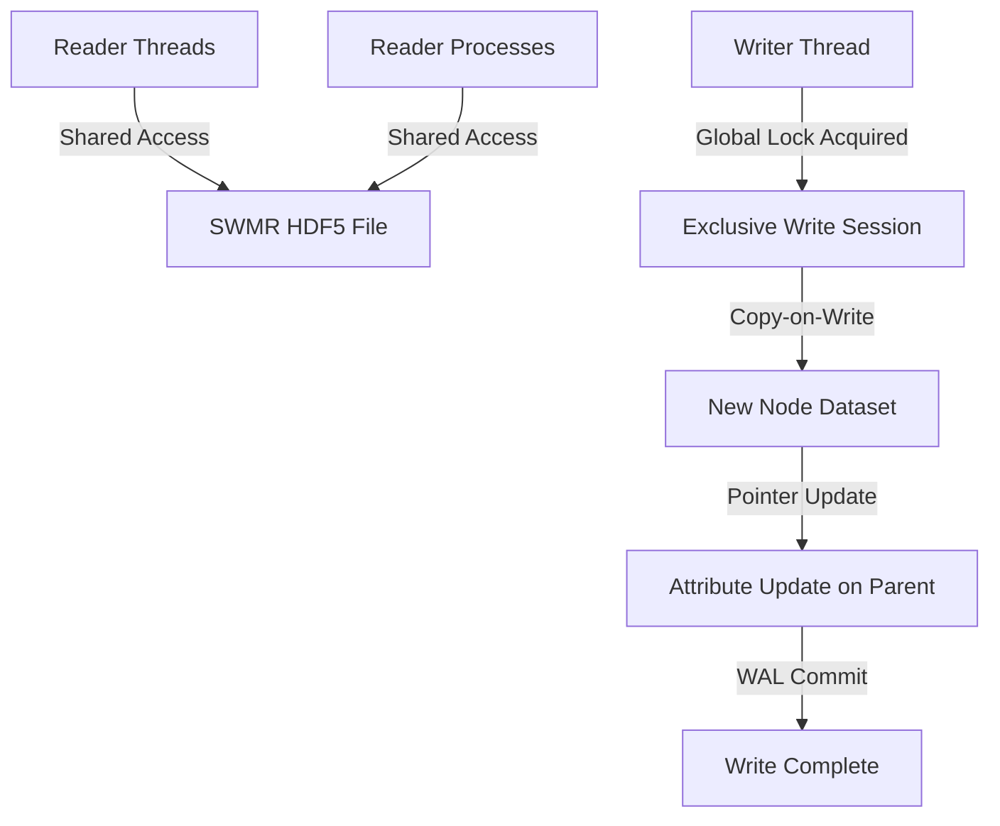

## 3. Node Structure

The tree is divided into **Leaf Nodes** and **Internal Nodes**.


### Node Abstraction: `NodeSchema`
All nodes (leaf and internal) follow a shared abstraction with clearly defined parts:

| Field Type     | Field Name       | Description |
|----------------|------------------|-------------|
| `Key[]`        | `keys`           | 128-bit entries; semantic in leaves, synthetic in internal nodes |
| `Pointer[]`    | `children`       | Only present in internal nodes; one more than the number of keys |
| `Value[]`      | `values`         | Only present in leaf nodes; CID payloads |
| `Link`         | `prev`, `next`   | Present only in leaf nodes; fixed-size binary pointers to neighboring leaves |


> **Invariant:** For all internal nodes, `len(children) == len(keys) + 1`

Each node type selectively instantiates these fields. The invariant for internal nodes is preserved:

### Leaf Nodes
- **Semantic keys:** Each leaf stores a set of SHA3-derived keys (split into key_high, key_low) with inherent meaning.
- **Linked structure:** Leaves include fixed-size binary pointers (`prev` and `next`) for efficient in-order traversal.
- **Data integrity:** The key present within the data matches the one derivable from the dataset’s content-addressable path.

- **Schema:**
  ```python
  leaf_dtype = np.dtype([
      ("key_high", "<u8"),
      ("key_low", "<u8"),
      ("value_high", "<u8"),
      ("value_low", "<u8"),
  ])
  ```
- **Linked structure:** Includes `prev` and `next` 16-byte pointers for fast traversal.
- **Semantic Constraint:** Leaf keys must be derived directly from data content; keys are sorted lexicographically by (key_high, key_low).
- **Duplicate Key Handling:**
  - Duplicate keys are allowed and stored as individual entries in the leaf node.
  - When approaching node overflow, prioritize externalizing high-count duplicate entries (multi-value keys) to compact external lists.

### Internal Nodes
- **Purpose:** Guide traversal via synthetic keys and child pointers.
- **Key-Child Mapping Invariant:**
  - `keys[i]` determines whether a query follows `children[i]` vs. `children[i+1]`.
- **Schema:**
  ```python
  internal_keys_dtype = np.dtype([
      ("key_high", "<u8"),
      ("key_low", "<u8"),
  ])
  child_ptr_dtype = np.dtype("S16")  # Compact fixed-size binary path
  ```

### Proposed Approach for Internal Node Schema
Because internal nodes have two different kinds of data—routing keys (synthetic keys) and child pointers (which are one more in number than the keys)—we need an explicit schema that cleanly represents both, yet maintains the invariant that:

> Number of children = Number of keys + 1

There are two common approaches:

**Separate Datasets or Parallel Arrays:**

- Keys Dataset: Create an HDF5 dataset for the keys using a compound data type. For example:
  ```python
  internal_keys_dtype = np.dtype([
      ("key_high", "<u8"),
      ("key_low", "<u8"),
  ])
  ```
- Children Pointers Array:
  ```python
  child_ptr_dtype = np.dtype("S16")
  ```

Maintain an attribute or parallel dataset that holds an array of these pointers. The shape invariant is preserved by design: if `keys.shape == (n,)`, then `children.shape == (n+1,)`. This separation allows atomic updates.


## 3.3 Dataset Paths
- **Node dataset paths:** Deterministically generated via a function:
  ```python
  def get_node_path(cid: CID, node_type: str) -> str:
      hex_key = f"{cid.high:016x}{cid.low:016x}"
      prefix = hex_key[:2]
      return f"/sp/nodes/{node_type}/{prefix}/{hex_key}"
  ```
- **Value-list datasets:** Stored under `/sp/values/sp/<name>` using a similar hashing function.

### Deletion Log alongside WAL

#### Roles:
- **WAL:** Handles transactional updates and recovery.
- **Deletion Log:** Marks nodes as obsolete for deferred cleanup.

#### Workflow:
```python
wal_entry = {
    "txn_id": 6789,
    "operation": "split",
    "old_node": "/sp/nodes/internal/5678",
    "new_nodes": ["/sp/nodes/internal/9012", "/sp/nodes/internal/3456"],
    "parent_update": "/sp/nodes/internal/1234"
}
append_to_wal(wal_entry)

delete_entry = {
    "path": "/sp/nodes/internal/5678",
    "timestamp": get_current_timestamp(),
    "reason": "split"
}
append_to_deletion_log(delete_entry)
```

#### Leaf Node Insertion Workflow


#### Internal Node Split Workflow


#### Read vs Write Access (SWMR Mode)



## Key Count Tracking for Internal Nodes
**Purpose:**
Key counts ensure internal nodes remain balanced and validate occupancy for rebalancing operations.

**Approach:**
- **In-Memory Tracking:** Maintain key counts in an external table rather than storing them on-disk.\n  - **Example:**
  ```python
  in_memory_table = {
      "/sp/nodes/internal/1234": {"key_count": 50},
      "/sp/nodes/internal/5678": {"key_count": 40},
  }
  ```
- **Lifecycle Management:**\n  - **Initialization:** Compute key count on node load.\n  - **Updates:** Adjust counts during insert, delete, or redistribution operations.\n  - **Cleanup:** Remove counts when nodes are unloaded.\n- **Overflow Handling:** Use these counts to decide on splits or merges, with support for node-specific dynamic thresholds.

**Benefits:**
- Improves efficiency by avoiding repeated computation.\n  - Keeps on-disk structures compact.\n  - Supports future scalability.


#### Internal Nodes:
- **Routing keys:** Keys in internal nodes—generated during node splits—are synthetic and serve solely to guide search decisions.
- **Routing invariant:** Each internal node has `len(children) == len(keys) + 1`.
- **Metadata:** Although stored as fixed-size binary values for consistency, these routing keys do not have content semantics.

**Proposed Approach for Internal Node Schema:**
Because internal nodes have two different kinds of data—routing keys (synthetic keys) and child pointers (which are one more in number than the keys)—we need an explicit schema that cleanly represents both, yet maintains the invariant that:

> Number of children = Number of keys + 1

There are two common approaches:

**Separate Datasets or Parallel Arrays:**

- **Keys Dataset:** Create an HDF5 dataset for the keys using a compound data type. For example:
  ```python
  internal_keys_dtype = np.dtype([
      ("key_high", "<u8"),
      ("key_low", "<u8"),
  ])
  ```

- **Children Pointers Array:** Store the child pointers in a separate dataset or as an attribute (an array) on the internal node group. For example, if child pointers are fixed-size binary values (say, 16-byte encoded strings), you can define:
  ```python
  child_ptr_dtype = np.dtype("S16")
  ```

Then maintain an attribute or a parallel dataset that holds an array of these pointers. By keeping them separate, you easily ensure that while the keys dataset might have shape `(n,)`, the children array has shape `(n+1,)`.

This separation makes it easier to update each part atomically during node operations.

### 3.2 Root Node Persistence
- **Stored in HDF5 Attribute:**
  ```yaml
  /sp/config:
    attrs: { root_node: "/sp/nodes/internal/1234" }
  ```

### 3.3 Dataset Paths
- **Node dataset paths:** Deterministically generated via a function:
  ```python
  def get_node_path(cid: CID, node_type: str) -> str:
      hex_key = f"{cid.high:016x}{cid.low:016x}"
      prefix = hex_key[:2]
      return f"/sp/nodes/{node_type}/{prefix}/{hex_key}"
  ```
- **Value-list datasets:** Stored under `/sp/values/sp/<name>` using a similar hashing function.
