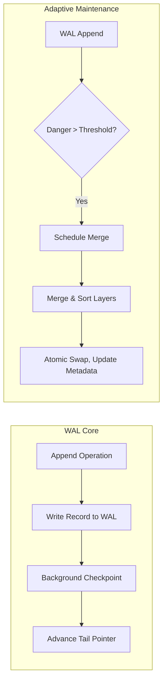
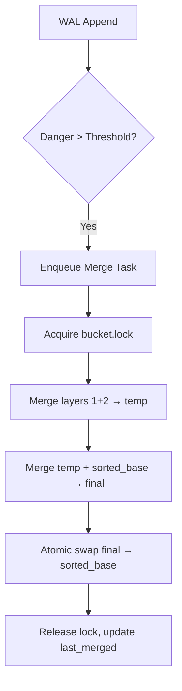

# 4. Write‑Ahead Log (WAL) Buffer



> **Note:** For canonical data‑structure diagrams and WAL record layout, see Spec 2: Data Types and Structure.

## 4.1 WAL Overview

| Feature            | Description                                                      |
|--------------------|------------------------------------------------------------------|
| Log Record Schema  | Records all mutating ops (insert, split, merge, delete)          |
| Checkpointing      | Periodic compaction to bound log size                            |
| Atomicity          | All ops use CoW; WAL logs every step for recovery                |
| Recovery           | WAL replay restores consistent state after crash                 |
| Performance        | Memory‑mapped ring buffer with cache‑aligned, fixed‑width records|

## 4.2 High‑Performance WAL Design

**Pre‑allocated, Memory‑Mapped Ring Buffer**

- Reserve a fixed‑size file (e.g. 64 MB) at startup.
- `mmap()` it into each writer process (`MAP_SHARED`).
- Header contains two 64‑bit offsets: head (next write) and tail (last checkpoint).

**Fixed‑Width, Cache‑Aligned Records**

- 64 bytes per record (power‑of‑two, one cache line).

**WAL Record Layout**

See [Spec 2: Data Types and Structure](spec%202%20-%20Data%20Types%20and%20Structure.md#wAL-record-layout) for the full WAL record schema.

2‑bit Version Field in the top bits of the version/op field:

- 0 = Past
- 1 = Current
- 2 = Next
- 3 = Future

**Lock‑Free Batch Appends**

- Each thread buffers N records (e.g. 64).
- Atomically `fetch_and_add(&head, N×64)` to reserve space.
- `memcpy()` all N×64 bytes into base + old_head.
- `sfence()` and light `msync()` of header cache line.

**Asynchronous Group Checkpoints**

- Background thread reads from tail up to head.
- Applies records to the B+Tree.
- Advances tail and `msync()`s the header.

**Partitioned WAL Files (Optional)**

- One WAL per shard or per hot bucket range to avoid head contention.
- Parallel background replay threads.

## 4.3 WAL Record Structure

See Spec 2 for the full schema. Each record includes:

- Version + Op (2-bit version, 6-bit opcode)
- Hybrid time (nanos, sequence, shard_id)
- Key high/low
- Value high/low
- Checksum
- Padding to 64 bytes

### WAL Opcode Meanings

The 6-bit opcode field in each WAL record encodes the type of operation. The following opcodes are defined:

| Opcode Name | Value | Description |
|-------------|-------|-------------|
| INSERT      |   1   | Insert a key-value pair into the tree. |
| DELETE      |   2   | Delete a key (and all its values) from the tree. |
| TXN_START   |   3   | Begin a transaction (used for grouping operations atomically). |
| TXN_COMMIT  |   4   | Commit a transaction (finalize all grouped operations). |
| TXN_ABORT   |   5   | Abort a transaction (rollback grouped operations; not always used). |

Opcodes are extensible; values 6–63 are reserved for future use (e.g., split, merge, schema migration, etc.).

The opcode is packed into the lower 6 bits of the `version_op` field, with the upper 2 bits used for the rolling version (see section 4.7).

All fields are fixed‑width and padded to 64 bytes.

## 4.4 Locking & SWMR Compliance

| Role        | Locking Model         | Workflow Summary                                              |
|-------------|----------------------|--------------------------------------------------------------|
| WAL Writers | Lock‑free on WAL path| Atomic head increment → memcpy → sfence/msync                |
| HDF5 Writers| Global RW lock       | Acquire → CoW update → release                               |
| Readers     | SWMR, no WAL lock    | Readers replay from tail without blocking WAL writers         |

## 4.5 Copy‑on‑Write & Atomic Updates

- Structure mutations use HDF5 CoW and atomic attribute updates.
- Chunked datasets support safe append/resizing.
- Global RW lock ensures single‑writer HDF5 consistency, while WAL writes remain lock‑free.

## 4.6 WAL‑Driven Adaptive Maintenance

WAL doubles as a maintenance queue: each bucket’s danger score (pending, unsorted, time‑since‑merge) triggers asynchronous merges.

| Metric      | Role                       |
|-------------|----------------------------|
| pending     | WAL entries (40%)          |
| unsorted    | On‑disk unsorted (30%)     |
| last_merged | Timestamp (30%)            |
| danger_score| Merge trigger              |
| bucket.lock | Per‑bucket isolation       |
| merge_log   | `/sp/maintenance_log/`     |



**Delta vs. Full Merge**

```python
delta = estimate_delta(sorted_base, temp)
if len(delta) < DELTA_THRESHOLD:
    apply_delta_inplace()
else:
    full_merge_bucket()
```

**Protections**

- Throttle or append‑only mode when danger_score > 0.9
- Hardware‑accelerated merge if available

**Cost‑Aware Scheduling**

```text
priority = (query_rate * danger_score) / estimated_merge_cost
```

**Recovery & Journaling**

- Each merge is journaled under `/sp/maintenance_log/` for rollback.
- Rollback via `triplestore recover --merge-point <timestamp>`.

## 4.7 Rolling Version Field

2‑bit version per record (0–3) in the version/op field:

- 0 = Past
- 1 = Current
- 2 = Next
- 3 = Future

**Upgrade workflow:**

- System writes new records with version 2 (Next).
- Recovery logic accepts both 1 and 2.
- After migration, reinterpret 2 → 1 (new Current), and 1 → 0 (Past).
- Rollback: flip active version in header; old records remain intact.

Common in systems like Kafka (magic byte) and RocksDB WAL.

---

**Summary**
This WAL design—mmap’d ring buffer, cache‑aligned fixed records with a rolling 2‑bit version, lock‑free batch appends, and async checkpoints—delivers multi‑million ops/sec throughput and in‑place schema evolution. Coupled with adaptive, WAL‑driven maintenance, it ensures both durability and sustained low latency under bursty or adversarial workloads.