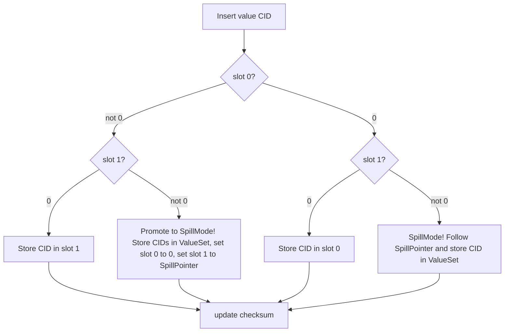

# 5. Multi-Value Keys

> **Note:** For canonical data structure diagrams, see [Spec 2: Data Types and Structure](spec%202%20-%20Data%20Types%20and%20Structure.md#data-structure).

## Layout Summary

| Mode   | Slot[0] | Slot[1] |
|--------|--------------------------------|----------|
| Inline | CID     |  CID        |
| Spill  |0 | SpillPointer  |
---

#### Promotion Algorithm

- If a key has ≤2 values, store them inline in `slots[0]` and `slots[1]`.
- If a key receives a 3rd value, promote all values to an external value-list (spill mode).
- In spill mode, the entry stores a SpillPointer to the external dataset.
- **Note:** In this implementation, spill mode is indicated when `slot[0] == 0`.

---

### 5.2 External Value Lists

For high-cardinality keys, an external HDF5 dataset (value list) is used. The bucket entry is updated to point to the external dataset. Queries retrieve the dataset in one read; deletions remove values and clean up empty datasets.

### 5.4 Value‑List Compaction

External value‑lists are append‑only with tombstoning. Compaction is a background process that removes tombstoned entries, orders lists, and reclaims space. Triggered by configurable thresholds, compaction is atomic and concurrent-safe, with metrics used to tune scheduling.

### 5.3 Hybrid & Promotion

Inline multi-values are used for low-cardinality keys; when a threshold is exceeded, promotion to an external value-list occurs (WAL-logged, atomic). Demotion is handled in maintenance to avoid thrashing. This hybrid approach reduces bucket bloat and ensures efficient memory use.

## 5.7 WAL‑Driven Adaptive Maintenance

See [Spec 4: Write-Ahead Log (WAL)](spec%204%20-%20WAL.md#45-wal-driven-adaptive-maintenance) for all details on danger score, merge scheduling, protections, and journaling.