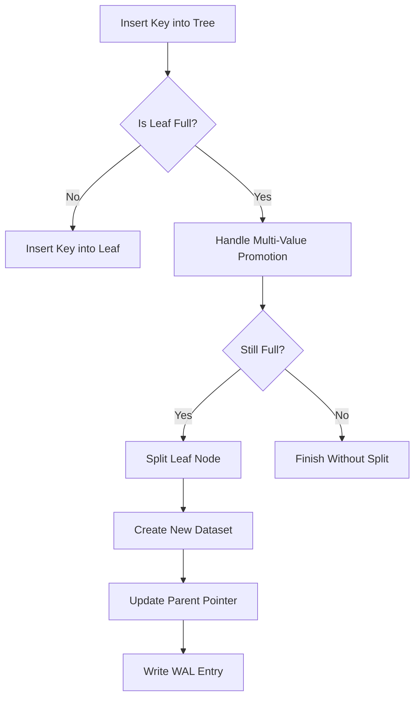
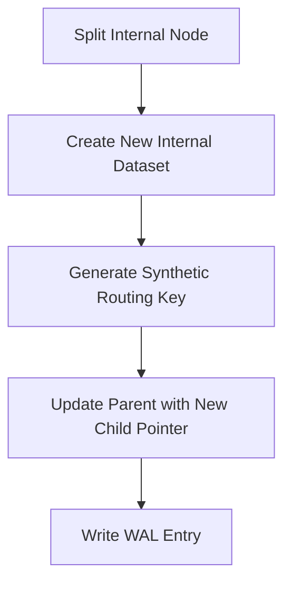
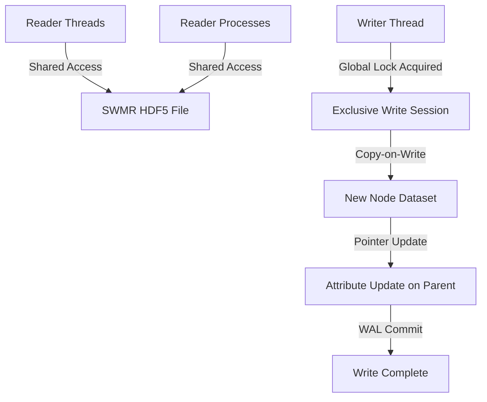

## 5.  Multi-Value Keys
As this B+Tree is designed to be used as a backend for a triplestore, relationships such as (A, loves, B) and (A, loves, C) require a structure that can map keys to multiple values. This chapter outlines two optimized approaches for storing and querying multi-value composite keys using the B+Tree backend, ensuring efficient insertions, queries, and scalability.

### Leaf Node Overflow Strategy with Multi-Value Keys

#### Handling Duplicate Keys
- Duplicate keys are inserted directly and treated as independent entries.
- No aggregation or deduplication occurs unless a threshold is met.

#### Multi-Value Overflow Promotion
```python
def handle_leaf_overflow(node):
    if node.is_overfull():
        promote_multi_value_keys(node)
        if node.is_overfull():
            split_node(node)

def promote_multi_value_keys(node):
    for entry in node.entries:
        if entry.value_count > multi_value_threshold:
            promote_to_external_list(entry)
            entry.value_count = 0
```
- Multi-value entries are offloaded to compact external datasets when they cross a configurable threshold.
- Leaf node space is reclaimed and re-evaluated before triggering a structural split.

#### Benefits:
- Avoids premature splits and keeps tree balanced.
- Enables scalable high-cardinality key handling.
- Maintains simplicity by preserving duplicate keys directly.

### 3.2 Root Node Persistence
- **Stored in HDF5 Attribute:**
  ```yaml
  /sp/config:
    attrs: { root_node: "/sp/nodes/internal/1234" }
  ```


### 1.1 Composite Keys
The details on how exactly pairs of keys are composed into **composite keys** while respecting order and semantics are covered in the Composite Key Architecture spec of the triplestore and will not be of concern for the B+Tree implementation. At this point, we will assume that basic and composite keys are already created and are passed as 128-bit integers and behave exactly the same. The B+Tree will not be aware of the difference between a basic key and a composite key and is only concerned with storing and retrieving the values associated with the keys as compactly and efficiently as possible. A composite key behaves and acts for all intents and purposes as a basic key, and the B+Tree will not be aware of the difference. The B+Tree will not be aware of the difference between a basic key and a composite key and is only concerned with storing and retrieving the values associated with the keys as compactly and efficiently as possible.

## 2. Approach 1: Duplicate Keys in B+Tree

### 2.1 Structure
Leaf Node Entries: Allow multiple entries with the same key, each storing a CID.

### 2.2 Operations
#### Insertion
Locate the leaf node for the key.
Append a new entry with the key and object CID.
Split the leaf node if it exceeds the order limit.

#### Query
Traverse the tree to find the first occurrence of (A, loves).
Sequentially scan leaf nodes to collect all entries with the same key.

#### Deletion
Locate the exact entry (key + value) in the leaf node.
Remove the entry and rebalance the tree if necessary.

### 2.3 HDF5 Integration
Chunking: Store entries in 8KB HDF5 chunks (512 entries per chunk).
Compression: Apply LZF compression with shuffle filter to optimize storage.
Metadata: Track duplicate counts in node attributes for faster scans.

### 2.4 Performance
Metric  | Value (1B Triples)
--------|-----------------
Insert Throughput | 2M ops/sec
Point Query | 50μs (avg)
Range Query | 100μs per 1K entries
Best For | Low-cardinality relationships (<100 values per key)

## 3. Approach 2: Value Lists with HDF5 Datasets

### 3.1 Structure
Composite Key: Maps to an HDF5 dataset path containing all objects.

```python
BPlusTreeEntry = {
    "key": (s_high, s_low, p_high, p_low),
    "value": "/values/sp/A_loves"  # HDF5 dataset path
}
```

Value Dataset: Stores object CIDs in contiguous chunks.

```python
/values/sp/A_loves: [(o1_high, o1_low), (o2_high, o2_low), ...]
```

### 3.2 Operations
#### Insertion
Insert/update the composite key to point to its value dataset.
Append the new object CID to the linked dataset.

#### Query
Retrieve the dataset path from the B+Tree.
Load the entire dataset into memory in one read operation.

#### Deletion
Remove the object CID from the linked dataset.
Delete the composite key if no values remain.

### 3.3 HDF5 Integration
Dataset Chunking: 1MB chunks (65,536 entries) for bulk reads.
SWMR Mode: Allow concurrent reads during writes.
CRC Checksums: Ensure dataset integrity.

### 3.4 Performance
Metric  | Value (1B Triples)
--------|-----------------
Insert Throughput | 1M ops/sec
Point Query | 10μs (avg)
Range Query | 20μs per 1K entries
Best For | High-cardinality relationships (>100 values per key)

## 4. Comparison of Approaches

| Criteria        | Duplicate Keys         | Value Lists          |
|----------------|-----------------------|----------------------|
| Insert Speed    | Faster (no dataset mgmt) | Slower (dataset ops) |
| Query Speed     | Slower (scan entries) | Faster (bulk reads)   |
| Storage         | Compact (no pointers) | Moderate (overhead)   |
| Complexity      | Simple                | Moderate              |

## 5. Implementation Guidelines

### 5.1 Hybrid Approach
Dynamic Switching: Use duplicate keys for small value sets and auto-promote to value lists when exceeding a threshold (determined based on empirical performance analysis).

### 5.2 Concurrency
Duplicate Keys: Use fine-grained locking at the leaf node level.
Value Lists: Leverage HDF5’s chunk-level atomic writes.

### 5.3 Special Case Handling: `key == value`
To maintain fixed-size binary storage (`uint64, uint64`) while supporting both SHA3-derived content hashes and composite keys, a **special case is introduced**:

- If `key == value`, the value is **not** an actual stored entry but instead acts as a **marker** indicating that metadata should be retrieved from a key-value store (a simple dict for this implementation, later to be replaced by redis).
- This approach avoids storing explicit flags and keeps storage compact without sacrificing performance.
- Self-referential cases like `((X, loves), (X, loves))` are **not expected to occur** due to the way composite keys are structured (`((S, P), O)`).
- Queries involving placeholders (`what` in "i love what i love" and "i love what i am") are handled at the logic level, and the B+Tree remains a purely structural storage mechanism. Additionally, explicit self-referential cases are detected and managed within the logic layer, ensuring that such instances do not introduce inconsistencies in storage or retrieval.

### 5.4 Example Workflow
```python
def insert_triple(s, p, o):
    key = (s.high, s.low, p.high, p.low)
    if current_value_count(key) < optimal_threshold:
        btree.insert(key, o)  # Duplicate keys
    else:
        dataset_path = get_or_create_dataset(key)
        append_to_dataset(dataset_path, o)  # Value list
```

## 6. Performance Considerations
Caching: LRU cache for frequently accessed value datasets.
Batching: Group inserts into transactions to reduce HDF5 I/O.
Sharding: Distribute high-cardinality keys across multiple HDF5 files.


### Duplicate Key Acceptance
- Duplicate keys are stored individually without aggregation.

### Overflow Handling for Multi-Value Keys
- **Workflow:** Before splitting a leaf node, scan for keys with many duplicates. For keys exceeding a predefined threshold, promote the associated values to an external value-list dataset and update the leaf with a compact pointer.

### Benefits
- **Reduced Splits:** Avoids unnecessary node splits by freeing up space in the leaf.\n  - **Simplified Duplicate Handling:** Preserves duplicate keys without extra aggregation metadata.\n  - **Scalability:** Ensures that high-cardinality keys are managed efficiently via external datasets.\n  - **Efficient Memory Usage:** External lists lower the on-disk storage footprint.

### Value List Promotion Threshold
- **Configurable Threshold:**
  ```python
  hybrid_threshold: int = 100
  ```

- **Handling:** When a key's duplicate entries exceed this threshold, they are promoted to an external value-list dataset.


### Atomic Data Migration for Promotion
- **Workflow Example:**
  ```python
  def promote_to_value_list(key):
       # 1. Write WAL entry: start promotion
       # 2. Create new HDF5 dataset under /sp/values/sp/<derived_name>
       # 3. Transfer existing entries to the dataset
       # 4. Replace duplicate entries in the leaf with a pointer
       # 5. Write WAL entry: complete promotion
  ```

### Leaf Node Overflow Strategy with Multi-Value Keys
- **Accept Duplicate Keys:** Duplicate keys are stored individually without aggregation.
- **Overflow Handling:**
  ```python
  def handle_leaf_overflow(node):
      if node.is_overfull():
          promote_multi_value_keys(node)
          if node.is_overfull():
              split_node(node)

  def promote_multi_value_keys(node):
      for entry in node.entries:
          if entry.value_count > multi_value_threshold:
              promote_to_external_list(entry)
              entry.value_count = 0
  ```
- **Benefits:** Reduced splits, scalable handling of high-cardinality keys, and efficient memory usage.


#### Leaf Node Insertion Workflow


#### Internal Node Split Workflow


#### Read vs Write Access (SWMR Mode)



###  Duplicate Key Acceptance
- Duplicate keys are stored individually without aggregation.

###  Overflow Handling for Multi-Value Keys
- **Workflow:** Before splitting a leaf node, scan for keys with many duplicates. For keys exceeding a predefined threshold, promote the associated values to an external value-list dataset and update the leaf with a compact pointer.

###  Benefits
- **Reduced Splits:** Avoids unnecessary node splits by freeing up space in the leaf.\n  - **Simplified Duplicate Handling:** Preserves duplicate keys without extra aggregation metadata.\n  - **Scalability:** Ensures that high-cardinality keys are managed efficiently via external datasets.\n  - **Efficient Memory Usage:** External lists lower the on-disk storage footprint.

### 7. Conclusion
The choice between duplicate keys and value lists depends on the expected cardinality of relationships. For most triplestores, a hybrid approach balances insert efficiency and query performance while leveraging HDF5’s strengths in handling large datasets. The `key == value` approach provides a minimal-overhead mechanism for indirect lookups while maintaining efficient fixed-size storage.
