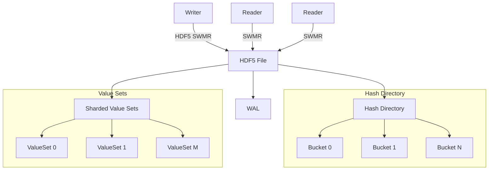

# CIDStore Specification Overview

| Feature                | Target/Description                       |
|------------------------|------------------------------------------|
| Scale                  | 1B keys, 100B values                     |
| Insert Throughput      | >1M ops/sec (batched)                    |
| Lookup Latency         | <50μs (avg), <100μs (P99)                |
| Recovery Time          | <30s after crash                         |
| Concurrency            | SWMR: 1 writer, many readers             |
| Range Queries          | Not supported                            |
| Transaction Isolation  | Eventual consistency for readers         |

## System Overview

This system is a disk-backed, concurrent hash directory for 128-bit keys and values, designed for massive scale, high throughput, and robust crash consistency. The architecture is composed of several tightly integrated components:

- **Hash Directory & Buckets:** An extensible array of HDF5-backed buckets, each with in-place sorted and unsorted regions for efficient insert and lookup. Buckets split and merge atomically (CoW + WAL) to maintain balance and performance.
- **Multi-Value Key Handling:** Each HashEntry stores up to two CIDs inline. If more than two values are associated with a key, the entry is promoted to reference an external HDF5 ValueSet (via a SpillPointer). Promotion/demotion is atomic and logged.
- **Write-Ahead Log (WAL):** All mutating operations (insert, split, merge, delete) are logged in a fixed-width, memory-mapped WAL for atomicity and crash recovery. WAL replay is idempotent and ensures consistency after failure.
- **Deletion Log & GC:** Deletions are tracked in a dedicated log. Background GC scans for orphans and reclaims space, with all operations being idempotent and safe for crash recovery.
- **Concurrency & SWMR:** HDF5 SWMR mode enables a single writer and many concurrent readers. All modifications use copy-on-write, and a global writer lock ensures consistency.
- **HDF5 Layout:** All data, metadata, and value-lists are stored in fixed, predictable HDF5 locations for fast access and easy recovery.
- **Microservice Layer & API Separation:** Exposed as a high-performance microservice with a ZMQ data plane (for all data operations, using versioned msgpack serialization) and a REST control plane (for health, metrics, configuration, and readiness checks). This clear separation ensures operational safety and observability. Containerization and Kubernetes are the primary deployment targets.
- **Auto-Tuning & Feedback Loop:** Adaptive batch size and flush interval tuning dynamically optimize throughput and latency under varying workloads.
- **Error Handling & API Versioning:** All network APIs are versioned and include explicit error handling for forward compatibility and operational safety.

For canonical data structure diagrams and type definitions, see [Spec 2: Data Types and Structure](spec%202%20-%20Data%20Types%20and%20Structure.md).

**Key Points:**
- Disk-backed, concurrent hash directory for 128-bit keys/values
- Optimized for scale, throughput, and crash consistency
- HDF5 SWMR mode for concurrency; extensible hashing for scalability

**Non-Goals:**
- No range queries (unordered keys)
- No in-place updates (append-only)
- Readers see eventual consistency
- No built-in access control, authentication, or encryption (must be external)

### Architecture Overview

## 1.8 Dependencies

| Dependency       | Version   | Description                                  |
|------------------|-----------|----------------------------------------------|
| Python           | 3.12+     | Minimum required version                     |
| HDF5             | 1.14.6+   | Scalable, chunked, compressed storage        |
| h5py             | 3.13+     | Python interface to HDF5                     |
| NumPy            | 2.2.5+    | Efficient data manipulation, dtypes          |
| CRC32C           | 2.7.1+    | Checksum validation for data integrity       |
| msgpack          | 1.0.7+    | Canonical wire format for all network APIs   |
| pyzmq            | 26.0.2+   | ZMQ data plane (all data operations)         |
| fastapi          | 0.110+    | REST control plane (monitoring/config)       |
| uvicorn          | 0.29+     | ASGI server for REST endpoints               |
| prometheus_client| 0.20+     | Metrics/monitoring integration (optional)    |

---

## 1.9 Testing & Validation

- System-level tests cover all workflows (insert, lookup, delete, split/merge, promotion/demotion)
- Crash recovery tests simulate failures at all WAL/CoW/metadata stages
- Fuzzing/randomized ops to uncover edge cases and concurrency bugs
- GC/orphan detection tests ensure correct reclamation and reconciliation
- All recovery/GC ops must be idempotent and leave the system consistent

---

## 1.10 Overview of Specifications

- [Spec 2: Data Types and Structure](spec%202%20-%20Data%20Types%20and%20Structure.md)
- [Spec 3: Bucket Structure and Directory Management](spec%203%20-%20Bucket%20Structure%20and%20Directory%20Management.md)
- [Spec 4: WAL](spec%204%20-%20WAL.md)
- [Spec 5: Multi-Value Keys](spec%205%20-%20Multi-Value%20Keys.md)
- [Spec 6: Bucket Splitting and Merging](spec%206%20-%20Bucket%20Splitting%20and%20Merging.md)
- [Spec 7: Deletion](spec%207%20-%20Deletion.md)
- [Spec 8: Concurrency & Crash Recovery](spec%208%20-%20Concurrency%20&%20Crash%20Recovery.md)
- [Spec 9: HDF5 Layout](spec%209%20-%20HDF5.md)
- [Spec 10: Microservice](spec%2010%20-%20Microservice.md)
- [Spec 11: Conclusion](spec%2011%20-%20Conclusion.md)