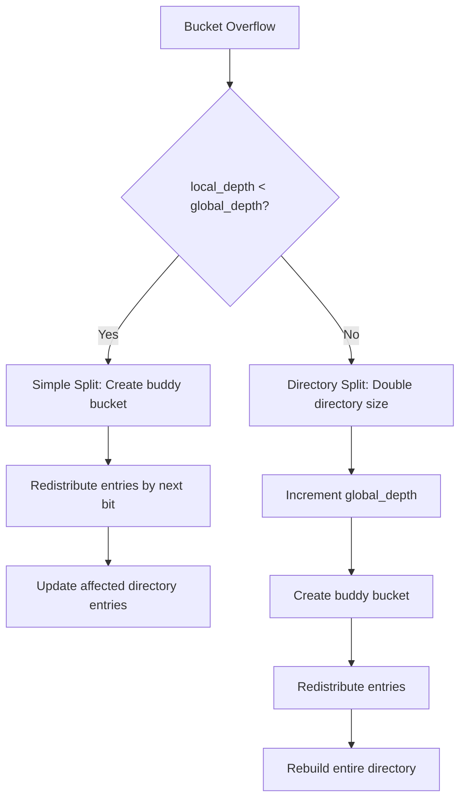
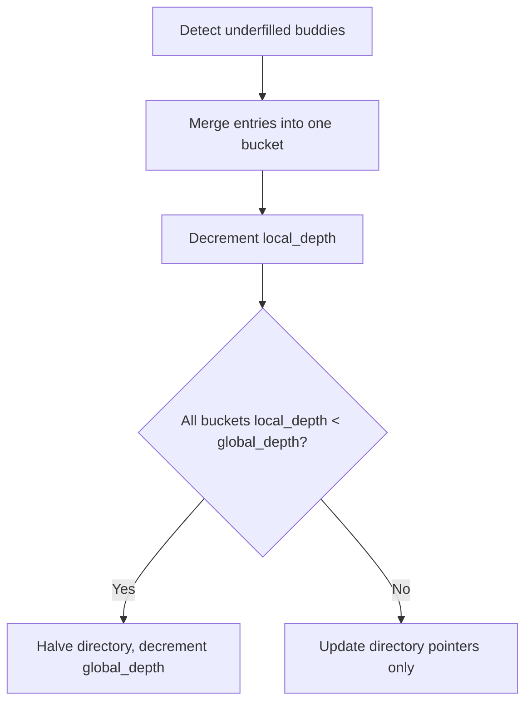

# 6. Bucket Splitting and Merging

All rebalancing uses extendible hashing with `global_depth` and `local_depth` for efficient, deterministic bucket management.

## 6.1 Extendible Hashing Split Algorithm



## 6.2 Split Scenarios

### Scenario 1: Simple Split (`local_depth < global_depth`)

| Step | Action | Example |
|------|--------|---------|
| 1 | Original bucket has `local_depth = 2`, `global_depth = 4` | Directory entries 0000, 0100, 1000, 1100 → Bucket A |
| 2 | Create buddy bucket with `local_depth = 3` | Bucket B created |
| 3 | Redistribute by bit 3 | Entries with bit 3 = 0 stay in A, bit 3 = 1 move to B |
| 4 | Update directory pointers | Entries 0000, 1000 → Bucket A; 0100, 1100 → Bucket B |

### Scenario 2: Directory Split (`local_depth == global_depth`)

| Step | Action | Impact |
|------|--------|--------|
| 1 | Double directory size | `2^global_depth` → `2^(global_depth+1)` entries |
| 2 | Increment `global_depth` | Each old entry duplicated in new directory |
| 3 | Perform simple split | As above, but with larger directory |

## 6.3 Merging (Buddy Bucket Collapse)

| Condition | Action |
|-----------|--------|
| Both buddy buckets underfilled | Merge into single bucket, decrement `local_depth` |
| Directory oversized | Halve directory if all buckets have `local_depth < global_depth` |

**Merge Workflow:**


## 6.4 Atomicity & Integrity

| Guarantee              | Mechanism                                                      |
|------------------------|---------------------------------------------------------------|
| Copy-on-Write          | Splits/merges create new bucket datasets, never in-place mods  |
| WAL Logging            | All changes (splits/merges, directory updates) logged for recovery |
| Atomic Directory Updates | Directory array and global_depth updated atomically via HDF5 attributes |

## 6.5 Bit Extraction for Redistribution

**Key Bit Extraction:**
```python
def extract_bit(key: E, bit_position: int) -> int:
    # Extract bit from key.high (MSB = bit 0)
    return (key.high >> (63 - bit_position)) & 1

def redistribute_entries(entries: List[HashEntry], local_depth: int):
    bucket_0 = []  # bit = 0
    bucket_1 = []  # bit = 1

    for entry in entries:
        if extract_bit(entry.key, local_depth) == 0:
            bucket_0.append(entry)
        else:
            bucket_1.append(entry)

    return bucket_0, bucket_1
```

## 6.6 Directory Pointer Management

**Update Directory After Split:**
```python
def update_directory_after_split(directory: Directory,
                                old_bucket_id: int,
                                new_bucket_id: int,
                                local_depth: int):
    # Find all directory entries pointing to old bucket
    step = 2 ** (directory.global_depth - local_depth)
    start = old_bucket_id * step

    # Update half to point to new bucket
    for i in range(start, start + step, 2):
        if extract_bit_from_index(i, local_depth - 1) == 1:
            directory.bucket_pointers[i].bucket_id = new_bucket_id
```

## 6.7 Performance Characteristics

| Operation | Time Complexity | Space Complexity |
|-----------|----------------|------------------|
| Lookup | O(1) directory + O(log B) bucket | O(1) |
| Simple Split | O(B) redistribution + O(2^(g-l)) pointer updates | O(B) |
| Directory Split | O(B) redistribution + O(2^g) directory rebuild | O(2^g) |
| Merge | O(B1 + B2) + O(2^(g-l)) pointer updates | O(B1 + B2) |

Where B = entries per bucket, g = global_depth, l = local_depth.

---

**Summary:**
- Extendible hashing provides deterministic, efficient bucket management
- Splits are local operations with predictable directory impact
- Directory growth is logarithmic, not linear
- All operations maintain atomicity through CoW + WAL