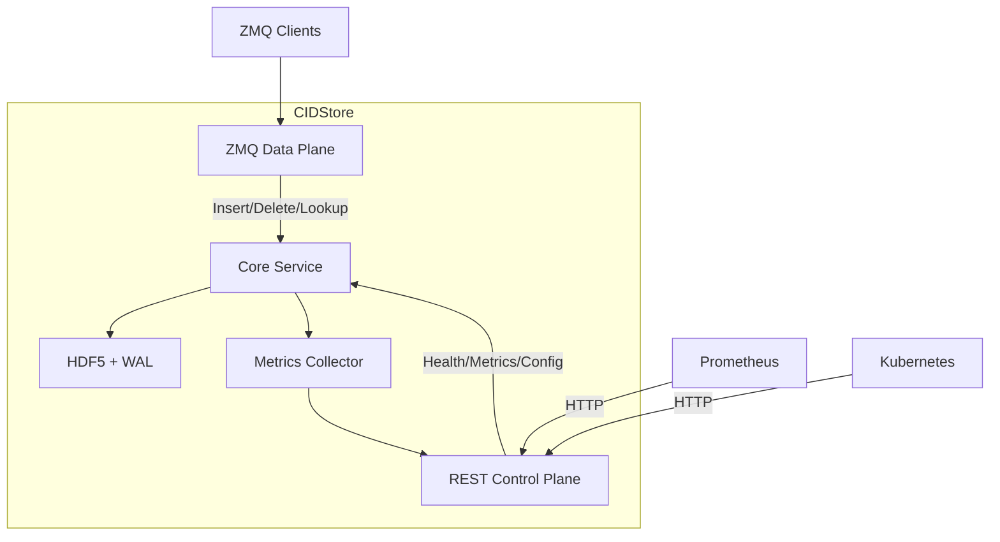
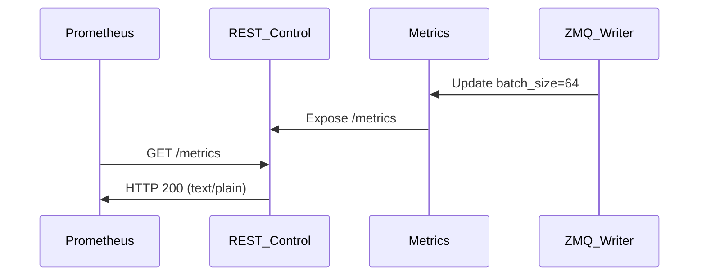
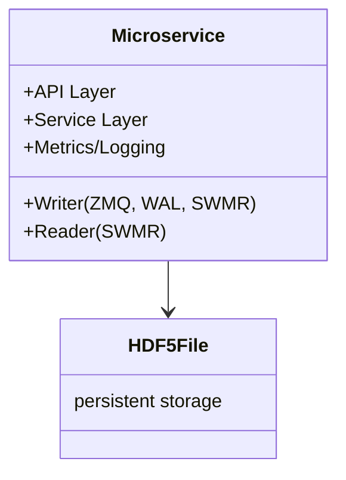
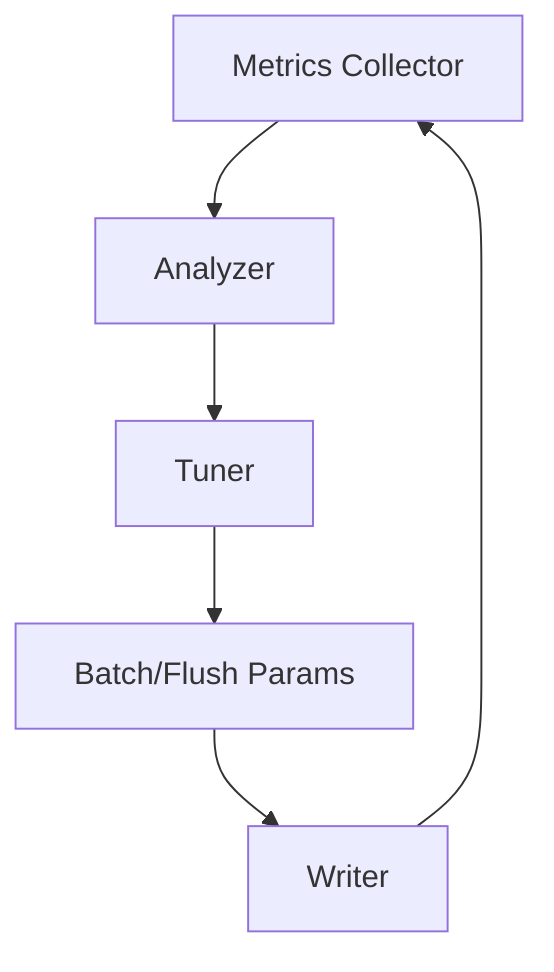
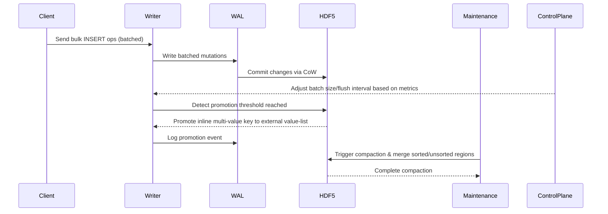

## 7. Why REST Makes Sense for Monitoring/Control

| Use Case                | REST Benefits                                                      | ZMQ Drawbacks                                      |
|-------------------------|--------------------------------------------------------------------|----------------------------------------------------|
| Health Checks           | Kubernetes/load balancers expect HTTP GET /health.                 | Requires custom ZMQ handlers for infra tooling.     |
| Metrics Scraping        | Prometheus/Grafana natively pull metrics via HTTP.                 | ZMQ requires custom exporters or sidecars.          |
| Configuration Updates   | REST’s human-readable JSON simplifies debugging.                   | Binary ZMQ messages are harder to inspect.          |
| Debugging/Ad-Hoc Queries| Tools like curl or Postman simplify diagnostics.                   | Requires ZMQ client setup for simple tasks.         |



**Key Components:**

- **ZMQ Data Plane:** Handles all data operations (inserts, deletes, lookups) for high throughput/low latency.
- **REST Control Plane:** Lightweight HTTP server for monitoring, health checks, and configuration.
- **Shared Core:** Both planes access the same metrics collector and configuration store.

### 7.1 Implementation Details

#### A. REST Endpoints (Control Plane Only)
| Endpoint                  | Method | Description                                 | Auth Level      |
|---------------------------|--------|---------------------------------------------|----------------|
| /health                   | GET    | Liveness probe (Kubernetes).                | None (public)  |
| /ready                    | GET    | Readiness probe (Kubernetes).               | None (public)  |
| /metrics                  | GET    | Prometheus-formatted metrics.               | None/metrics   |
| /config/promotion_threshold| GET/PUT| View/update promotion threshold.             | Admin (JWT)    |
| /config/batch_size        | GET/PUT| Adjust auto-tuning batch parameters.         | Admin (JWT)    |
| /debug/bucket/{id}        | GET    | Inspect bucket metadata (slot occupancy, load).   | Debug (IP whitelist) |


#### B. Performance Isolation

- **Separate Thread Pools:**
    - ZMQ Data Plane: Dedicated thread(s) with real-time priority.
    - REST Control Plane: Async I/O (e.g., FastAPI/Starlette) with lower priority.
- **Resource Limits:**
    - REST server capped at 10% CPU/memory to avoid starving ZMQ operations.

#### C. Security

- **REST:**
    - /health and /metrics are unauthenticated but rate-limited.
    - Admin endpoints (/config/*) use JWT or mutual TLS (mTLS).
    - Debug endpoints restricted to internal IPs.
- **ZMQ:**
    - CURVE encryption remains enforced for all data operations.

#### D. Metrics Flow



### 7.2 Benefits

- **Operational Simplicity:** No need for a separate REST gateway just for monitoring.
- **Tooling Compatibility:** Works seamlessly with Kubernetes, Prometheus, and cloud providers.
- **Low Overhead:** REST server is idle 99% of the time (only polls/health checks).
- **Debugging:** Engineers can quickly query /debug/bucket/123 without ZMQ tooling.

### 7.3 Risks & Mitigations

| Risk                    | Mitigation                                                      |
|-------------------------|-----------------------------------------------------------------|
| HTTP Server Overhead    | Use async frameworks (FastAPI) + limit threads.                 |
| Security Exposure       | Strict auth for admin/debug endpoints; rate-limiting for public ones. |
| Resource Contention     | Isolate REST to a dedicated core (Kubernetes CPU pinning).      |
| Added Complexity        | Keep REST code minimal (<5% of codebase) and separate from ZMQ logic. |

### 7.4 Example Workflow: Adjusting Batch Size

Admin sends:

```bash
curl -X PUT -H "Authorization: Bearer $JWT" \
  -d '{"batch_size": 128}' \
  http://cidstore/config/batch_size
```

CIDStore:

- Validates JWT and permission.
- Updates in-memory batch size (atomic variable).
- Logs change and emits metric config_change_count.

### 7.5 Final Recommendation

Adopt REST for Control Plane with the following guardrails:

- **Strict Scope:** Only for monitoring, health checks, and infrequent config changes.
- **Performance Isolation:** Async I/O, resource limits, and separate thread pools.
- **Security:** Auth for admin endpoints, IP whitelisting for debugging.

This approach retains the ZMQ core’s performance while simplifying operations—a pragmatic balance.
# Microservice


## 1. Introduction

This specification describes the transformation of the disk-backed, concurrent hash directory into a high-performance microservice. The system leverages HDF5, WAL, and CoW for durability and scalability, and exposes a modern API for integration via ZeroMQ.

```mermaid
flowchart TD
    A[External API (REST/gRPC)] --> B[Service Layer]
    B --> C[Writer (ZMQ, SWMR, WAL)]
    B --> D[Reader (SWMR)]
    C --> E[HDF5 File]
    D --> E
    B --> F[Metrics/Logging]
```

## 2. API Design and Communication

### 2.1 API Layer (ZMQ Only)

All communication with CIDStore is via ZeroMQ (ZMQ) for maximum performance and low-latency messaging. There is no direct REST/gRPC interface; a separate REST gateway will be deployed for external clients.

**API operations are exposed as ZMQ message patterns:**

| Operation      | Pattern      | Description                                 |
|--------------- |-------------|---------------------------------------------|
| Insert         | PUSH/PULL    | Insert values for a key (single/batch)      |
| Delete         | PUSH/PULL    | Delete all values for a key or specific value|
| Batch Insert   | PUSH/PULL    | Batch insert multiple key-value pairs        |
| Batch Delete   | PUSH/PULL    | Batch delete multiple keys or key-value pairs|
| Lookup         | ROUTER/DEALER| Retrieve all values for a key               |
| Metrics/Status | ROUTER/DEALER| Query system metrics, health, or status     |


**Message serialization:** MessagePack (msgpack, required) for all ZMQ messages. JSON may be used for debugging.

**Error Handling:** Standardized error codes/messages in ZMQ replies.

**API Versioning:** Versioning is handled at the message schema level (e.g., proto package version). The same rolling versioning scheme as used in the WAL is applied to the API.


### 2.2 Internal Communication (ZeroMQ)

| Pattern         | ZMQ Type      | Purpose                                  |
|-----------------|--------------|------------------------------------------|
| Writer Serial   | PUSH/PULL     | All writes go to a single writer         |
| Concurrent Read | ROUTER/DEALER | Multiple readers, request-reply          |
| Notifications   | PUB/SUB       | Broadcast state changes (optional)       |

**Optimizations:**
- Use `inproc://` for intra-process, UNIX sockets for local IPC
- Use binary serialization, msgpack for all messages


## 3. Internal Architecture



| Component         | Role/Notes                                                      |
|-------------------|-----------------------------------------------------------------|
| Service Layer     | Parses API requests, routes to internal ops                     |
| Writer            | Single-threaded, handles all mutations, WAL, SWMR               |
| Reader            | Multiple, concurrent, SWMR                                      |
| Background Tasks  | WAL checkpoint, compaction, merge, GC (async)                   |
| Caching           | Bucket metadata, ValueSet, directory index                      |
| Storage           | HDF5 file (local or NAS/shared FS)                              |


## 4. Deployment & Operations

| Aspect                | Approach/Tooling                                             |
|-----------------------|-------------------------------------------------------------|
| Containerization      | Docker/Podman (Python, HDF5, h5py, NumPy, CRC32C)            |
| Orchestration         | Kubernetes StatefulSet (single writer), read replicas        |
| Resource Allocation   | CPU, memory, storage requests/limits                         |
| Monitoring            | Prometheus metrics, structured JSON logs                     |
| Health Checks         | `/health` (liveness), `/ready` (readiness)                   |
| Crash Recovery        | WAL + CoW, <30s recovery                                    |
| Backup/Restore        | Procedures for HDF5 data                                    |
| Config Management     | Env vars, ConfigMaps                                        |
| Security              | API gateway/service mesh (TLS, auth), ZMQ CURVE for internal |


## 5. Adaptive Performance Management & Auto-Tuning



| Metric                | Description                                 |
|-----------------------|---------------------------------------------|
| latency_p99           | 99th percentile observed latency            |
| throughput_ops        | Operations processed per second             |
| buffer_occupancy      | Pending ops in writer’s in-memory queue     |
| flush_duration        | Time to commit a batch to WAL/HDF5          |
| lock_contention_ratio | % of time global HDF5 writer lock is held   |
| error_rate            | Failed writes due to timeouts/resources     |


**Feedback Loop:**

1. Metrics Collector (ZMQ/Prometheus)
2. Analyzer (detects trends, bottlenecks)
3. Tuner (adjusts batch size, flush interval)
4. Writer (applies new params)


**Auto-Tuning Strategies:**

- Batch size grows if latency is low and buffer is filling
- Batch size shrinks if latency is high or errors increase
- Flush interval adapts to throughput and buffer occupancy
- PID-style adjustment for stability (Kp=0.5, Ki=0.1, Kd=0.3)


**Safety:**
- Batch size: 32 ≤ batch ≤ 1024
- Circuit breaker: revert to safe defaults if latency > 150μs for 5s
- Hysteresis: require 3+ violations before adjusting
- Anomaly detection: ignore metric spikes


**Implementation:**
- Control loop: collect → analyze → adjust → sleep (100ms–1s)
- Thread-safe params (atomic/mutex)
- Metrics: HDRHistogram, lock-free counters
- Expose tuning decisions as Prometheus metrics
- Log parameter changes with context


**Dynamic Weighting:**
- Throughput mode: prioritize buffer_occupancy, throughput_ops
- Latency mode: prioritize latency_p99, error_rate
- Hybrid: weighted blend of both


**Testing & Calibration:**
- Synthetic benchmarks (ramp from 100K to 2M ops/sec)
- Chaos testing (latency spikes, failures, partitions)
- A/B test auto-tuning vs. fixed params
- Calibrate PID in staging


**Tuning Knobs:**
```yaml
autotune:
  enabled: true
  control_interval_ms: 200
  latency_target_p99_us: 100
  min_batch_size: 32
  max_batch_size: 1024
  kp: 0.5
  ki: 0.1
  kd: 0.3
  safety_circuit_breaker: true
```


## 6. Scalability

| Aspect         | Approach                                                      |
|---------------|---------------------------------------------------------------|
| Read          | Multiple read-replica microservice instances                  |
| Write         | Single writer (initially); sharding for extreme write loads   |
| Sharding      | Partition hash directory, route by key                        |
| Bottleneck    | Batch mutations to amortize writer lock                       |


## 7. Use Cases

### 1. Bulk Insert → Promotion → Compaction

| Step | Actor         | Action                                                      | Notes                                      |
|------|--------------|-------------------------------------------------------------|--------------------------------------------|
| 1    | Client       | Send bulk INSERT ops (batched)                              |                                            |
| 2    | Writer       | Batch and write mutations to WAL                            | Batch size adjustable by control plane     |
| 3    | WAL          | Commit changes via CoW to HDF5                              |                                            |
| 4    | ControlPlane | Adjust batch size/flush interval                            | Based on metrics                           |
| 5    | Writer/HDF5  | Detect promotion threshold, promote to external value-list  | Promotion logged in WAL                    |
| 6    | Maintenance  | Trigger compaction & merge sorted/unsorted regions in HDF5  | Background process                         |
| 7    | HDF5         | Complete compaction                                         |                                            |




---

### 2. Delete → GC Workflow

| Step | Actor        | Action                                                      | Notes                                      |
|------|-------------|-------------------------------------------------------------|--------------------------------------------|
| 1    | Client      | Request DELETE for key/value                                |                                            |
| 2    | Writer      | Log deletion operation in WAL and DeletionLog               | Ensures atomicity and traceability         |
| 3    | WAL         | Commit delete via CoW update to HDF5                        |                                            |
| 4    | GC          | Scan DeletionLog, cross-check bucket metadata               | Identify orphaned entries                  |
| 5    | GC          | Remove orphaned value-lists & merge underfilled buckets     | Cleanup operations                         |
| 6    | HDF5        | Confirm cleanup                                             |                                            |
| 7    | System      | Safety: hysteresis/circuit breaker if delete-to-GC latency spikes | Revert to safe config or alert        |

```mermaid
sequenceDiagram
    participant Client
    participant Writer
    participant WAL
    participant DeletionLog
    participant GC
    participant HDF5

    Client->>Writer: Request DELETE for key/value
    Writer->>WAL: Log deletion operation
    Writer->>DeletionLog: Record deletion details
    WAL->>HDF5: Commit delete via CoW update
    GC->>DeletionLog: Scan for deletion entries
    GC->>HDF5: Cross-check bucket metadata
    GC->>HDF5: Remove orphaned external value-lists & merge underfilled buckets
    HDF5-->>GC: Confirm cleanup

    # Control Plane Endpoints

    | Endpoint                   | Method | Description                                 | Auth Level      |
    |----------------------------|--------|---------------------------------------------|----------------|
    | /health                    | GET    | Liveness probe (Kubernetes).                | None (public)  |
    | /ready                     | GET    | Readiness probe (Kubernetes).               | None (public)  |
    | /metrics                   | GET    | Prometheus-formatted metrics.               | None/metrics   |
    | /config/promotion_threshold| GET/PUT| View/update promotion threshold.            | Admin (JWT)    |
    | /config/batch_size         | GET/PUT| Adjust auto-tuning batch parameters.       | Admin (JWT)    |
    | /debug/bucket/{id}         | GET    | Inspect bucket metadata (slot occupancy, load).  | Debug (IP whitelist) |

    Writer->>DeletionLog: Record deletion details
    WAL->>HDF5: Commit delete via CoW update
    GC->>DeletionLog: Scan for deletion entries
    GC->>HDF5: Cross-check bucket metadata
    GC->>HDF5: Remove orphaned external value-lists & merge underfilled buckets
    HDF5-->>GC: Confirm cleanup
```

---

## 8. Summary

The microservice architecture for the hash directory system combines HDF5, WAL, and CoW for durability and performance. It exposes a modern API, supports adaptive auto-tuning, and is designed for scalable, observable, and robust deployment in modern cloud environments.