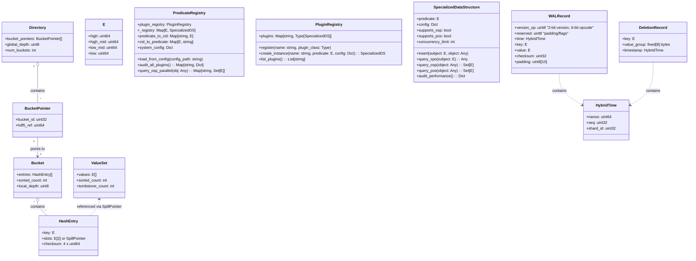
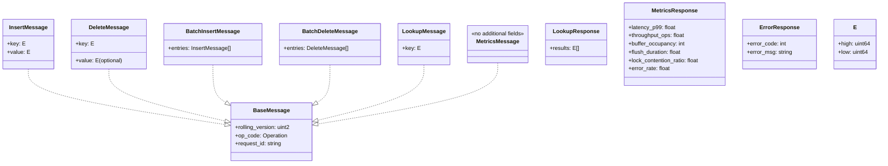

# 2. Data Types and Structure

## 2.1 Data Structure

**Note:** The UML diagram below is the authoritative source for all structure layouts.



---

## 2.2 Data Type Definitions

All types are fixed-width for O(1) access. See UML above for explicit field names and dtypes.

| Component         | Structure / dtype fields                                      | Size   | Description                                                      |
|-------------------|--------------------------------------------------------------|--------|------------------------------------------------------------------|
| Key               | `[high: u64, high_mid: u64, low_mid: u64, low: u64]`        | 32B    | 256-bit immutable identifier (full SHA-256 CID, stored as 4×64-bit components) |
| Hash Entry        | `[key_high: u64, key_high_mid: u64, key_low_mid: u64, key_low: u64, slots: [(high: u64, high_mid: u64, low_mid: u64, low: u64), (high: u64, high_mid: u64, low_mid: u64, low: u64)] or SpillPointer, checksum: u256]` | 144B   | Maps 256-bit key to up to two 256-bit values inline, or to an external ValueSet via SpillPointer. No state mask. |
| Value Set         | `[E[] values, sorted_count: u32, tombstone_count: u32]`    | Var    | External dataset for high-cardinality keys; tombstone for GC     |
| Spill Pointer     | `[ref: u64]`                                                 | 8B     | HDF5 object reference to external ValueSet (spill mode)          |
| Deletion Record   | `[key_high: u64, key_low: u64, value_group: S8, timestamp: u64]` | 32B    | Tracks obsolete keys for GC; timestamp is Unix ns                |
| Directory         | `[BucketPointer[] bucket_pointers, global_depth: u8, num_buckets: u32]` | Var    | Array of bucket pointers indexed by top `global_depth` bits of key |
| Bucket            | `[HashEntry[] entries, sorted_count: u32, local_depth: u8]` | Var    | Bucket with sorted and unsorted regions; `local_depth` determines key bits that belong to this bucket |
| Bucket Pointer    | `[bucket_id: u32, hdf5_ref: u64]`                           | 12B    | Points to bucket dataset in HDF5, indexed by key prefix          |
| Predicate Plugin | `[plugin_name: string, plugin_class: Type[SpecializedDS]]` | Var | Plugin class registered in PluginRegistry for creating specialized DS instances |
| Plugin Registry  | `[plugins: Map[string, Type[SpecializedDS]]]`              | Var    | Explicit registry mapping plugin names to implementation classes |
| Predicate Registry | `[_registry: Map[E, SpecializedDS], predicate_to_cid: Map[string, E], system_config: Dict]` | Var | Combines CIDSem validation with plugin instantiation and configuration loading |
| Performance Config | `[supports_osp: bool, supports_pos: bool, concurrency_limit: int, baseline_ms: float]` | Var | Per-predicate performance characteristics and constraints |
| System Config    | `[max_concurrent_osp: int, max_predicates: int, monitoring_enabled: bool]` | Var | Global system-level configuration for plugin infrastructure |

## 2.3 Extendible Hashing Scheme

### Bucket Lookup Algorithm

```python
def find_bucket(key: E, global_depth: int) -> bucket_id:
    # Extract top global_depth bits from key.high
    directory_index = key.high >> (64 - global_depth)
    return directory.bucket_pointers[directory_index].bucket_id
```

### Directory Size

- Directory size is always `2^global_depth` entries
- Each entry is a `BucketPointer` that maps to the actual bucket
- Multiple directory entries may point to the same bucket (when `local_depth < global_depth`)

## sorted_count Purpose
- The `sorted_count` field in the either Bucket and ValueSet structure is used to track the number of entries in the sorted region. This allows for efficient binary search operations on the sorted entries, while new inserts are appended to the unsorted region.

|Layer|	Purpose
|---|---|
|Bucket|	Optimizes key lookup in hash entrys
|ValueSet|	Optimizes containment checks for a single value within the set of values & deduplication

## 2.4 Metadata & Constraints

- All fields are fixed-width for O(1) access (except ValueSet.values, which is a fixed-type array)
- No variable-length fields; all pointers are explicit (BucketPointer contains HDF5 object reference)
- Keys and value pointers are immutable after insertion
- SWMR metadata stored as HDF5 attributes under `/config`
- `global_depth` stored as HDF5 attribute under `/config/global_depth`
- Each bucket's `local_depth` stored as HDF5 attribute on the bucket dataset

### SpillPointer and Promotion
- The presence of a SpillPointer in a HashEntry indicates that the values for the key are stored externally in a ValueSet dataset.
- When a key has more than two values, the entry is promoted to spill mode and a SpillPointer is used.
- Demotion is possible if the value count drops to two or fewer.

### Predicate Specialization and Plugin Architecture
- **Registry-Based Routing:** When a predicate is registered for specialization, queries check the in-memory predicate registry for dispatch.
- **Composite Key System:** Non-specialized predicates use composite keys from spec20 (composite(S,P,r) patterns for SPO/OSP/POS).
- **Explicit Plugin Registry:** Plugins are explicitly registered by name with their implementation classes (no dynamic discovery).
- **Configuration-Driven:** JSON/YAML config files map CIDSem predicates to plugin instances with performance characteristics.
- **Query Pattern Support:**
  - **SPO (Subject-Predicate-Object):** Direct registry check, route to plugin or composite key system
  - **OSP (Object-Subject-Predicate):** Parallel fan-out across registered predicates using reverse indices (respects `supports_osp` flag)
  - **POS (Predicate-Object-Subject):** Direct query to specific predicate's reverse index (respects `supports_pos` flag)
  - **Unknown-P patterns:** Fan-out to all ~200 registered predicates with concurrency control
- **Performance Management:**
  - Per-predicate `supports_osp` and `supports_pos` flags control query capabilities
  - Per-predicate `concurrency_limit` for resource management
  - System-wide `max_concurrent_osp` for parallel query control
  - Plugin-specific `audit_performance()` method for monitoring
- **Built-in Plugins:**
  - `counter`: Atomic integer operations with OSP/POS support
  - `multivalue_set`: Set-based multi-value storage with OSP/POS support
  - `timeseries`: Time-ordered data with optional OSP support
  - `fulltext`: Text search (typically `supports_osp=false` due to cost)

## 2.5 Network Message Schema (msgpack via zmq)

**Note:** The UML diagram below is the authoritative source for all network message layouts.



---

### Network Message Type Definitions

| Message Type         | Fields / dtype fields                                                                 | Description                                                                 |
|----------------------|--------------------------------------------------------------------------------------|-----------------------------------------------------------------------------|
| BaseMessage          | `[rolling_version: uint2, op_code: Operation, request_id: string]`                   | All messages include a 2-bit rolling version, operation code, and request id|
| InsertMessage        | `[key: E, value: E]`                                                             | Insert a single value for a key                                              |
| DeleteMessage        | `[key: E, value: E (optional)]`                                                  | Delete a value for a key (or all values if value omitted)                    |
| BatchInsertMessage   | `[entries: InsertMessage[]]`                                                         | Batch insert of multiple key-value pairs                                     |
| BatchDeleteMessage   | `[entries: DeleteMessage[]]`                                                         | Batch delete of multiple key-value pairs                                     |
| LookupMessage        | `[key: E]`                                                                         | Lookup all values for a key                                                  |
| MetricsMessage       | `[]`                                                                                 | Request server metrics                                                       |
| LookupResponse       | `[results: E[]]`                                                                   | Response to a lookup, contains all values                                    |
| MetricsResponse      | `[latency_p99: float, throughput_ops: float, buffer_occupancy: int, flush_duration: float, lock_contention_ratio: float, error_rate: float]` | Server metrics response                                                      |
| ErrorResponse        | `[error_code: int, error_msg: string]`                                               | Standardized error response                                                  |

**Operation Enum Values:**

| Value                | Description                                      |
|----------------------|--------------------------------------------------|
| INSERT               | Insert a single value for a key                  |
| DELETE_KEY           | Delete all values for a key                      |
| DELETE_VALUE_FROM_KEY| Delete a specific value from a key               |
| BATCH_INSERT         | Insert multiple key-value pairs in a batch       |
| BATCH_DELETE         | Delete multiple key-value pairs in a batch       |
| GET                  | Get all values for a given key                   |
| METRICS              | Request server metrics                           |

**E Structure:**

| Field     | Type    | Description                         |
|-----------|---------|-------------------------------------|
| high      | uint64  | Highest 64 bits of 256-bit CID      |
| high_mid  | uint64  | High-middle 64 bits of 256-bit CID  |
| low_mid   | uint64  | Low-middle 64 bits of 256-bit CID   |
| low       | uint64  | Lowest 64 bits of 256-bit CID       |

**Cross-References:**
- [Spec 12: Predicate Specialization](spec%2012%20-%20Predicate%20Specialization.md) - Query patterns and specialized DS APIs
- [Spec 13: Plugin Infrastructure](spec%2013%20-%20Plugin%20Infrastructure.md) - Plugin system for extensible predicate specialization

---