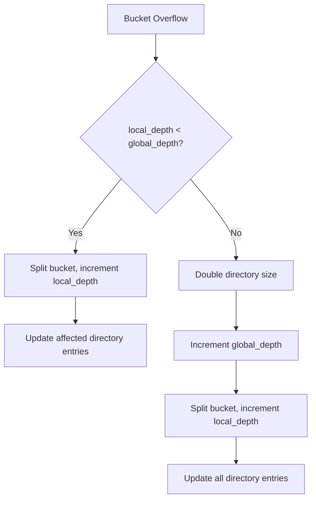

3. Bucket Structure and Directory Management

# 3. Bucket Structure & Directory Management

> **Note:** For canonical data structure diagrams, see [Spec 2: Data Types and Structure](spec%202%20-%20Data%20Types%20and%20Structure.md#data-structure).

The hash directory uses extendible hashing with `global_depth` and `local_depth` for efficient, scalable bucket management.

## 3.1 Extendible Hashing Overview

| Component      | Description                                                      |
|---------------|------------------------------------------------------------------|
| Global Depth   | Number of bits used to index the directory (directory size = 2^global_depth) |
| Local Depth    | Per-bucket depth determining which key bits belong to this bucket |
| Directory      | Array of bucket pointers, indexed by top `global_depth` bits of key |
| Bucket Lookup  | Extract top `global_depth` bits from `key.high` as directory index |

**Key Lookup Algorithm:**
```python
directory_index = key.high >> (64 - global_depth)
bucket_pointer = directory.bucket_pointers[directory_index]
bucket = load_bucket(bucket_pointer.hdf5_ref)
```

### 3.2 Bucket Abstraction

| Component      | Description                                                      |
|---------------|------------------------------------------------------------------|
| Dataset       | Contiguous array of hash entries (`hash_entry_dtype`)             |
| Sorted Region | `sorted_count` entries, binary search for O(log N) lookup        |
| Unsorted      | Appended entries, linear scan; merged on maintenance             |
| Local Depth   | Number of key bits that determine membership in this bucket      |

**Lookup:**
| Step   | Action                                      |
|--------|---------------------------------------------|
| 1      | Binary search in sorted region               |
| 2      | Linear scan in unsorted region if not found  |

**Insert:**
| Step   | Action                                      |
|--------|---------------------------------------------|
| 1      | Append to unsorted region                    |
| 2      | `sorted_count` unchanged until maintenance   |

### 3.3 In-Place Sorting / Merging

| Trigger                | Example/Condition         |
|------------------------|--------------------------|
| Unsorted > threshold   | Configurable             |
| Low write activity     | Background maintenance   |
| Regular maintenance    | Periodic scan            |

**Merge/Sort Workflow:**
```mermaid
flowchart TD
    A[Insert Entry] --> B[Append to unsorted region]
    B --> C{Maintenance Trigger?}
    C -- No --> D[Continue]
    C -- Yes --> E[Sort unsorted region]
    E --> F[Merge with sorted region]
    F --> G[Update sorted_count]
    G --> H[Atomic update (CoW + WAL)]
```

### 3.4 Bucket Splitting Algorithm



**Split Scenarios:**

| Condition | Action | Directory Impact |
|-----------|--------|------------------|
| `local_depth < global_depth` | Split bucket only | Update 2^(global_depth - local_depth) entries |
| `local_depth == global_depth` | Double directory first | Update entire directory |

**Split Workflow:**
1. Check if `local_depth < global_depth`
2. If equal, double directory size and increment `global_depth`
3. Create new bucket with `local_depth + 1`
4. Redistribute entries based on next bit in key
5. Update directory pointers atomically

### 3.5 Directory Growth Patterns

| Global Depth | Directory Size | Memory Usage (12B per entry) |
|--------------|----------------|------------------------------|
| 8            | 256            | 3 KB                         |
| 16           | 65,536         | 768 KB                       |
| 20           | 1,048,576      | 12 MB                        |
| 24           | 16,777,216     | 192 MB                       |

**Growth is logarithmic:** Directory only doubles when a bucket with `local_depth == global_depth` needs to split.

### 3.6 Atomicity & Integrity

| Guarantee              | Mechanism                                                      |
|------------------------|---------------------------------------------------------------|
| Copy-on-Write          | Splits create new bucket datasets, never in-place mods        |
| WAL Logging            | All changes (splits, directory updates) logged for recovery   |
| Atomic Pointer Updates | Directory array updated atomically via HDF5 attributes        |

After each operation, validation confirms bucket and directory mapping consistency.

### 3.7 Concurrency Adjustments

| Aspect         | Guarantee/Approach                                                      |
|--------------- |-------------------------------------------------------------------------|
| SWMR           | Single-writer (HDF5 SWMR); exclusive lock for splitting                 |
| WAL Logging    | All split/directory-update ops logged for crash recovery                |
| Reader Impact  | Readers see old directory until atomic swap completes                   |

### 3.8 Maintenance & GC

| Task                | Purpose                                         |
|---------------------|-------------------------------------------------|
| Merge/sort          | Consolidate unsorted data for efficient lookups |
| Background process  | Maintains performance under high insert load     |

### 3.9 Caching Strategies

Efficient in-memory caching is critical for high-throughput and low-latency operation. CIDTree employs several targeted caches:


### 3.9.1 In‑Memory Bucket Metadata Cache

- Caches `BucketHealth`, inline slots, and spill pointers for recently accessed buckets.
- Uses LRU/ARC keyed by `bucket_id`.
- Evicts least-recently-used entries as needed.
- Invalidation occurs on merge/maintenance or WAL replay affecting a cached bucket.

---


### 3.9.2 ValueSet Dataset Cache

- Caches recently read external datasets under `/hash/shards/.../values`.
- Uses LRU for open HDF5 handles; supports chunk prefetch for sequential scans.

---


### 3.9.3 Directory Index Cache

- Caches hot shard mappings from `bucket_id` to `shard_id` to avoid repeated lookups.

---


### 3.9.4 Write‑Through & Consistency

- Inline cache is write-through: updates on every WAL insert/delete.
- Spill transitions and maintenance merges invalidate or refresh affected cache entries.

---


### 3.9.5 Monitoring Cache Effectiveness

Cache stats are exposed via metrics (hit/miss/ratio/entries) for observability.

To ensure safe evolution of on-disk formats, data types, and directory layouts, CIDTree introduces explicit **versioning**, **schema registration**, and **automated migration** steps.

### 3.10.1 Versioning Scheme

- **Format Version**: A 32-bit integer stored as an HDF5 attribute under `/config/format_version`.
- **Semantic Version**: A string `MAJOR.MINOR.PATCH` in `/config/version_string` for human reference.

| MAJOR | Incompatible on-disk change (require full migration) |
|-------|------------------------------------------------------|
| MINOR | Backwards-compatible additions (e.g. new dataset, new field) |
| PATCH | Bug fixes, maintenance (no schema change) |

---

### 3.10.2 On-Disk Version Attributes

```yaml
/config:
  attrs:
    format_version:   <u4>       # bump on any structural change
    version_string:   "1.2.0"    # human-readable
    created_timestamp: <f8>
```
`format_version` is checked on file open.

If `format_version` > code_supported_version, the system refuses to open (to prevent data loss).

If `format_version` < code_supported_version, migrations are applied automatically.

### 3.10.3 Schema Evolution Strategies

**Additive Fields**

New datasets or attributes may be added without breaking readers of older fields. Always provide a default for any new attribute or field so old files can be opened seamlessly.

**Deprecated Paths**

Mark old groups/datasets as deprecated by adding an attribute `deprecated = true`. Migration tool can coalesce or rename these to new paths.

**Field Renaming**

Introduce new field alongside the old, migrate data (via script), then deprecate old field in the next MAJOR bump.

### 3.10.4 Automated Migration Tools

Provide a CLI command:

```bash
cidtree migrate --from-format 1 --to-format 2 --input file.h5 --output file-v2.h5
```

**Steps:**

1. Open `file.h5`, verify `format_version == from-format`.
2. Apply per-format migration functions in sequence (e.g. `migrate_1_to_2(h5file)`):
   - Add new `/hash/shards` group.
   - Move existing `/hash/buckets` into the first shard.
   - Update `format_version = 2`.
3. Write updated file to `file-v2.h5` (or in-place with backup).
4. Validate using new schema invariants, logging any anomalies.

Each migration function is idempotent and reversible (via backup).

### 3.10.5 In-Place Upgrades with Rollback

On startup, if `format_version < current_version`, run migrations in-place under a global lock:

- Backup the original file to `file.h5.bak`
- Migrate each step, committing updates and bumping `format_version`
- Validate; if any error, restore from backup and exit.

Operators can opt out of automatic in-place migration and use the CLI tool instead.


### 3.10.6 Migration Examples

- **Adding state_mask ECC:** Upgrade all index entries to 8-bit SECDED code and bump `format_version`.
- **Sharding Buckets:** Move all buckets under `/hash/shards/shard0000/`, update pointers, and bump `format_version`.


### 3.10.7 Backwards Compatibility & Roll-Forward

Code supports reading any compatible `format_version`. New clients write the latest format. Explicit versioning and reversible migrations ensure safe, predictable upgrades.

To operate and tune the system in production, CIDTree exposes rich metrics, logs, and traces for maintenance, garbage collection, and error conditions.


### 3.11.1 Metrics

Metrics include bucket health, merge/GC stats, and error counters. All are exposed for monitoring and alerting.

---


### 3.11.2 Logging

Logs include merge/GC events, danger_score warnings, and error conditions. Log lines are structured for easy parsing and alerting.


### 3.11.3 Tracing

Traces span inserts, maintenance, and WAL operations, with trace IDs for cross-correlation.


### 3.11.4 Exposing Metrics

Metrics are exported via Prometheus and HDF5 snapshots, with alerting on key thresholds.

With these observability hooks, operators gain full visibility into bucket health, merge performance, GC progress, and error conditions—enabling rapid diagnosis, tuning, and automated alerting.

**Directory Management**

| Feature            | Mechanism/Guarantee                                                      |
|--------------------|--------------------------------------------------------------------------|
| Bucket Lookup      | Top `global_depth` bits of `key.high` index directory array             |
| Split Trigger      | Overflow → check local vs global depth → split or grow directory        |
| Directory Growth   | Only when `local_depth == global_depth` (logarithmic growth)            |
| Copy-on-Write      | New bucket dataset created, directory updated atomically                 |
| Atomic Metadata    | Directory array and depths updated via HDF5 attributes                  |
| WAL Logging        | All splits/updates logged for crash recovery                             |
| Reader Consistency | Readers see either old or new state, never in-between                    |
| **Scalability**    | Extendible hashing provides efficient, predictable scaling               |


## Directory Storage and Migration Path

### Current Approaches

**Small/Medium Scale:** For deployments with a relatively modest number of buckets, the directory is stored as HDF5 attributes. This approach leverages HDF5’s lightweight attribute mechanism for rapid lookups and ease of management.

**Large Scale:** When the number of buckets grows (for example, exceeding ~1M buckets) or when the metadata update costs become a bottleneck, a dedicated directory dataset is used. This structure organizes bucket metadata in a tabular (or sharded) format that supports efficient indexing, chunking, and concurrent updates.

### Migration Path

To accommodate the evolution of deployments from small/medium to large scale, the following migration path is designed:

#### Monitoring and Threshold Detection

- **Threshold Parameter:** Define a configurable threshold (e.g., `MIGRATION_THRESHOLD` such as 1M buckets or a defined attribute size limit) that triggers the need for migration.
- **Monitoring:** Continuously monitor the directory’s attribute count and update frequency. When the observed metrics exceed the threshold, a migration is scheduled.

#### Preparation Phase

- **Migration Tool/Process:** Develop a migration tool (or integrate a scheduled maintenance process) that reads bucket metadata from HDF5 attributes and writes it into a newly created, dedicated directory dataset.
- **Schema Definition:** The dedicated dataset is defined using HDF5 compound types, with fields such as bucket ID, metadata pointers (e.g., spill pointers, ECC state mask), and versioning data.
- **Backup and Consistency:** Ensure that a consistent snapshot is taken—either by temporarily locking updates or by using multi-version coordination—to avoid discrepancies during migration.

#### Migration Execution

- **Batch Processing:** Transfer the metadata in manageable batches, updating the new directory dataset incrementally. This process can run as a background maintenance task during off-peak periods to minimize impact on ongoing operations.
- **Validation:** After migration, validate that every bucket’s metadata has been correctly transferred by comparing key integrity metrics between the attribute store and the new dataset.

#### Configuration Update

- **Atomic Switch:** Once the migration is complete and validated, update the system configuration (or central metadata pointer) to indicate that the directory is now served by the dedicated dataset rather than HDF5 attributes.
- **Cache Invalidation:** Invalidate or refresh any caches that reference the old attribute-based directory data to ensure consistency across the system.

#### Cleanup and Deprecation

- **Old Attributes Removal:** Optionally, after a grace period, the old HDF5 attributes can be cleaned up or marked as deprecated to avoid confusion and clear unneeded storage.
- **Documentation and Alerts:** Document the migration process in system logs and provide alerts if any discrepancies are detected. This feedback loop helps fine-tune future migrations as the deployment scales further.

#### Summary

This migration path ensures a smooth transition from an attribute-based directory to a dedicated dataset:

- It is configurable and adapts to thresholds that indicate when attribute overhead becomes prohibitive.
- It uses a controlled, batch-oriented migration process with proper validation to maintain consistency.
- It enables the system to scale seamlessly without interrupting service, while providing a clear rollback/cleanup plan.

**For details on the ECC-protected state mask, see [Spec 5: Multi-Value Keys](spec%205%20-%20Multi-Value%20Keys.md#ecc-protected-state-mask--slot-layout).**

**Sharded Directory:**
- Partition the directory into shards, each as a separate HDF5 group or dataset, with a higher-level directory mapping bucket ranges to shards.
- Reduces update contention and enables parallel access to different directory shards.

**Hybrid Approach:**
- Frequently modified metadata (e.g., recent bucket updates) is stored in a dedicated dataset or sharded structure, while static configuration remains as attributes.

**Implementation Considerations:**
- Indexing: Use HDF5 compound types and chunking to support binary search and rapid lookups.
- Concurrency: Use transactional semantics or external locking for updates to minimize contention and support high concurrency.
- Migration: Start with attributes for simplicity, but provide a migration path to a dedicated/sharded dataset as the number of buckets grows.

**Cost of Resizing:**

| Cost Factor         | Description                                                                 |
|---------------------|-----------------------------------------------------------------------------|
| Localized Impact    | Only overloaded bucket is affected; cost is linear in bucket size           |
| Amortized Perf.     | Splits are rare, so average-case performance is minimally impacted          |
| Pathological Cases  | Repeated splits reduce load; fallback (e.g., in-bucket index) if necessary |

---

## Value-List Compaction

## ValueSet Compaction

For details on value-set compaction (removal of deleted or obsolete values from external value-set datasets), see [Spec 5: Multi-Value Keys](spec%205%20-%20Multi-Value%20Keys.md#value-list-compaction). This process is essential for reclaiming space and maintaining performance in buckets with multi-value keys.

**Note:** Value-set compaction is also relevant to deletion and maintenance operations. For implementation and workflow, refer to the cross-referenced section in the multi-value key spec.